# Narsil benchmarks: one engine, embedded or on a server

Narsil runs two ways from a single codebase. You can embed it inside your
application process like a library, and you can run it as a search server that
scales across machines. This page measures both, because portability is the
goal: the engine that indexes a few thousand documents inside a browser tab is
the same engine that answers queries behind an HTTP API.

Every number and every chart on this page comes from a recorded run. A script
reads the latest run of each suite and fills the tables below from the raw results,
while a second script draws each figure into the run's own directory. A
continuous-integration check fails the build if the page or a figure ever differs
from those recordings. Each section links to the run it came from so you can read
the per-engine detail and reproduce the figures yourself.

## Search servers: keyword, vector, and hybrid retrieval

The first comparison runs over HTTP against six production search engines on
[BEIR](https://github.com/beir-cellar/beir) datasets, the datasets and metrics
that the published information-retrieval leaderboards use. Each engine ingests the
corpus, answers the dataset's test queries, writes a TREC run file, and gets
scored with `pytrec_eval`, the same tool the BEIR leaderboard uses. The comparison
runs three tracks. The keyword track scores BM25 ranking. The vector track scores
dense nearest-neighbour search. The hybrid track scores keyword and vector
combined. On the vector and hybrid tracks every engine receives identical
precomputed vectors from one fixed embedding model, so the comparison measures the
index and holds the embedder constant.

Narsil calibrates its BM25 against the Anserini reference configuration, so the
rest of the comparison stands on a trusted baseline. The setup, the pinned engine
versions, and the datasets all come from the recorded run.

<!-- BENCH:server-setup START -->
- **Run.** These figures come from run `20260804T184221Z`, recorded on 2026-08-04 from commit `ad93b7f4fe58`. The raw per-engine results and the full comparison are in [the run report](benchmarks/server/results/runs/20260804T184221Z/comparison.md).
- **Datasets.** The run covers SciFact (5,183 documents) and NFCorpus (3,633 documents), each loaded and hash-verified through `ir_datasets`.
- **Engines.** The comparison runs Narsil 0.2.2 against Elasticsearch 9.5.0, Meilisearch 1.52.0, OpenSearch 3.7.0, Qdrant 1.18.3, Typesense 30.2, and Weaviate 1.39.0, and every engine runs from a pinned image.
- **Equal conditions.** Every engine receives the same 8.6 GB memory cap, the same run depth of 1,000, and the same run-file ordering, and the engines run one at a time so latency never contends.
- **Load.** The harness measured throughput at 16 concurrent clients, one pass per level.
- **Narsil threads.** This run recorded no worker copy configuration for Narsil.
- **Machine.** The run executed on GCP c3-standard-8, us-central1-a, which reports Intel(R) Xeon(R) Platinum 8481C CPU @ 2.70GHz and Linux 6.17.0-1021-gcp x86_64.
- **BM25 calibration.** Narsil indexes each corpus with BM25 k1=0.9 and b=0.4, the Anserini reference configuration.
<!-- BENCH:server-setup END -->

Each track below opens with two bar charts per dataset, ranking quality and peak
throughput, followed by the table behind them. Where a run measured more than one
concurrency level, a line chart then follows each engine across those levels, and
the setup block above says which levels a run measured. A latency profile at the
end of the track shows how far each engine's tail stretches at its own peak. That
under-load latency comes from the throughput passes, because their five-second
windows hold several times more samples than the serial track, so p99.9 rests on
more than the slowest one or two requests.

### Keyword track

Narsil's BM25 is calibrated to the Anserini reference, so it ranks with the
Lucene engines on these graded judgements and finishes a little ahead of them on
both datasets. Typesense and Meilisearch apply their own documented ranking
models in place of BM25, which places them lower here.

<!-- BENCH:server-keyword START -->
**SciFact.**

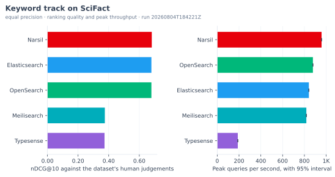

| Engine | nDCG@10 | Recall@100 | MAP | MRR | Peak QPS |
| --- | ---: | ---: | ---: | ---: | ---: |
| Narsil | 0.6814 | 0.9253 | 0.6417 | 0.6494 | 958 |
| Elasticsearch | 0.6789 | 0.9253 | 0.6401 | 0.6506 | 841 |
| OpenSearch | 0.6789 | 0.9253 | 0.6401 | 0.6506 | 878 |
| Meilisearch | 0.3748 | 0.5302 | 0.3467 | 0.3534 | 818 |
| Typesense | 0.3728 | 0.3923 | 0.3659 | 0.3784 | 189 |

**NFCorpus.**

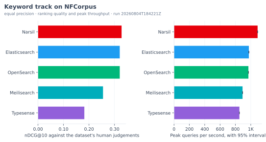

| Engine | nDCG@10 | Recall@100 | MAP | MRR | Peak QPS |
| --- | ---: | ---: | ---: | ---: | ---: |
| Narsil | 0.3278 | 0.2489 | 0.1532 | 0.5305 | 1,089 |
| Elasticsearch | 0.3206 | 0.2457 | 0.1503 | 0.5255 | 975 |
| OpenSearch | 0.3206 | 0.2457 | 0.1503 | 0.5255 | 969 |
| Meilisearch | 0.2550 | 0.1701 | 0.1167 | 0.4338 | 893 |
| Typesense | 0.1817 | 0.1123 | 0.0839 | 0.3372 | 852 |

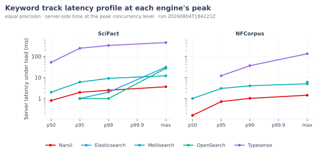
<!-- BENCH:server-keyword END -->

### Vector track

Every engine indexes the identical vectors and tunes its search effort up to the
same matched recall point against the exact nearest neighbours. Retrieval quality
is therefore equal across engines by construction, so this track compares speed at
that point. The throughput differences at a few thousand vectors reflect
per-request handling at this corpus size, since every engine sits near full recall
at a modest search effort. Where the run recorded throughput at every step of the
recall sweep, a further chart draws queries per second against recall, so you can
see how much throughput each engine gives up for the last point of recall.

<!-- BENCH:server-vector START -->
On SciFact, every engine tunes its search effort to reach ann_recall@10 of at least 0.99 against the exact neighbours, and each returns the same ranking, so nDCG@10 is 0.6239 and Recall@100 is 0.9227 across the field. On NFCorpus, every engine tunes its search effort to reach ann_recall@10 of at least 0.99 against the exact neighbours, and each returns the same ranking, so nDCG@10 is 0.3145 and Recall@100 is 0.3094 across the field.

**SciFact.**

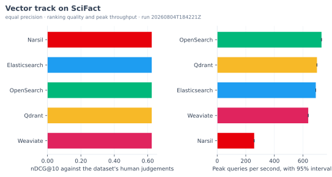

| Engine | Search effort | ANN recall@10 | Peak QPS |
| --- | --- | ---: | ---: |
| OpenSearch | ef_search 64 | 0.9957 | 730 |
| Qdrant | hnsw_ef 32 | 0.9937 | 698 |
| Elasticsearch | num_candidates 64 | 0.9937 | 690 |
| Weaviate | ef 64 | 0.9950 | 637 |
| Narsil | efSearch 64 | 0.9967 | 259 |

**NFCorpus.**

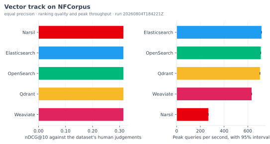

| Engine | Search effort | ANN recall@10 | Peak QPS |
| --- | --- | ---: | ---: |
| Elasticsearch | num_candidates 128 | 0.9938 | 715 |
| OpenSearch | ef_search 128 | 0.9944 | 710 |
| Qdrant | hnsw_ef 128 | 0.9969 | 703 |
| Weaviate | ef 128 | 0.9929 | 632 |
| Narsil | efSearch 128 | 0.9950 | 267 |

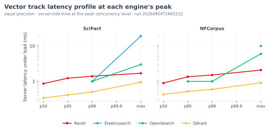
<!-- BENCH:server-vector END -->

### Hybrid track

Hybrid fusion combines the keyword and vector rankings, and the fusion method
differs per engine, so ranking quality varies again.

<!-- BENCH:server-hybrid START -->
**SciFact.**

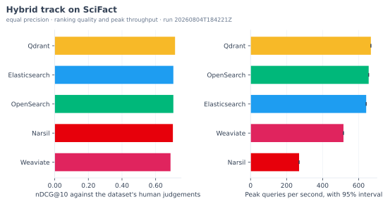

| Engine | nDCG@10 | Recall@100 | MAP | MRR | Peak QPS |
| --- | ---: | ---: | ---: | ---: | ---: |
| Qdrant | 0.7155 | 0.9577 | 0.6730 | 0.6762 | 668 |
| Elasticsearch | 0.7053 | 0.9610 | 0.6587 | 0.6643 | 642 |
| OpenSearch | 0.7053 | 0.9610 | 0.6587 | 0.6643 | 656 |
| Narsil | 0.7026 | 0.9643 | 0.6543 | 0.6615 | 269 |
| Weaviate | 0.6885 | 0.9577 | 0.6405 | 0.6513 | 516 |

**NFCorpus.**

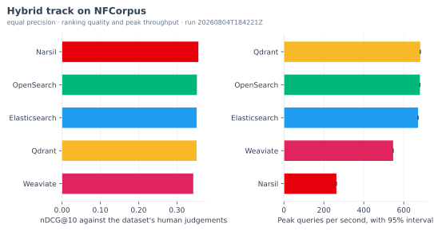

| Engine | nDCG@10 | Recall@100 | MAP | MRR | Peak QPS |
| --- | ---: | ---: | ---: | ---: | ---: |
| Narsil | 0.3560 | 0.3239 | 0.1878 | 0.5745 | 263 |
| OpenSearch | 0.3521 | 0.3216 | 0.1867 | 0.5653 | 681 |
| Elasticsearch | 0.3516 | 0.3216 | 0.1866 | 0.5633 | 672 |
| Qdrant | 0.3515 | 0.3239 | 0.1826 | 0.5686 | 683 |
| Weaviate | 0.3427 | 0.3180 | 0.1811 | 0.5584 | 547 |

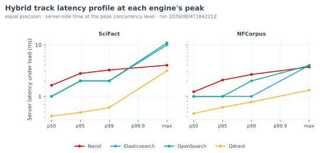
<!-- BENCH:server-hybrid END -->

### Recommended production settings

The tracks above hold every engine at full float so that the comparison isolates
the index. Each engine also recommends a quantisation for production, and this
second pass runs the vector and hybrid tracks under those settings. The tables name
the quantisation each engine applied once a run records it. Every engine still
tunes its search effort to the same recall target, so compression differs by engine
on purpose while the accuracy bar stays fixed. The equal-precision figures above
remain the headline.

<!-- BENCH:server-vector-best-config START -->
**SciFact.**

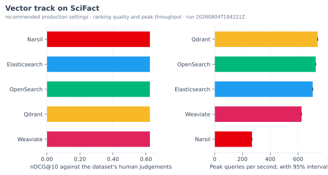

| Engine | Search effort | ANN recall@10 | Peak QPS |
| --- | --- | ---: | ---: |
| Qdrant | hnsw_ef 32 | 0.9930 | 740 |
| OpenSearch | ef_search 64 | 0.9940 | 727 |
| Elasticsearch | num_candidates 256 | 0.9957 | 705 |
| Weaviate | ef 64 | 0.9953 | 625 |
| Narsil | efSearch 64 | 0.9967 | 269 |

**NFCorpus.**

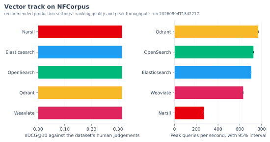

| Engine | Search effort | ANN recall@10 | Peak QPS |
| --- | --- | ---: | ---: |
| Qdrant | hnsw_ef 64 | 0.9916 | 770 |
| OpenSearch | ef_search 128 | 0.9938 | 726 |
| Elasticsearch | num_candidates 512 | 0.9848 | 704 |
| Weaviate | ef 128 | 0.9938 | 630 |
| Narsil | efSearch 128 | 0.9947 | 270 |

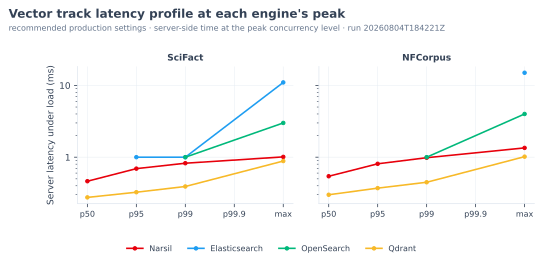
<!-- BENCH:server-vector-best-config END -->

<!-- BENCH:server-hybrid-best-config START -->
**SciFact.**

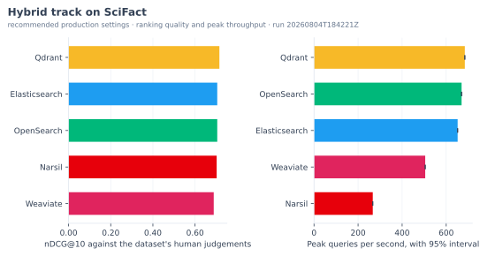

| Engine | nDCG@10 | Recall@100 | MAP | MRR | Peak QPS |
| --- | ---: | ---: | ---: | ---: | ---: |
| Qdrant | 0.7155 | 0.9577 | 0.6730 | 0.6762 | 685 |
| Elasticsearch | 0.7053 | 0.9610 | 0.6587 | 0.6643 | 652 |
| OpenSearch | 0.7053 | 0.9610 | 0.6587 | 0.6643 | 670 |
| Narsil | 0.7026 | 0.9643 | 0.6543 | 0.6615 | 267 |
| Weaviate | 0.6886 | 0.9577 | 0.6407 | 0.6513 | 505 |

**NFCorpus.**

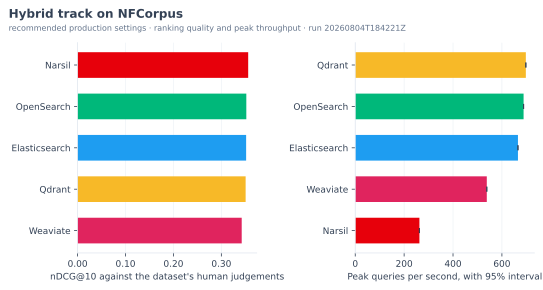

| Engine | nDCG@10 | Recall@100 | MAP | MRR | Peak QPS |
| --- | ---: | ---: | ---: | ---: | ---: |
| Narsil | 0.3560 | 0.3239 | 0.1878 | 0.5745 | 263 |
| OpenSearch | 0.3521 | 0.3216 | 0.1867 | 0.5653 | 689 |
| Elasticsearch | 0.3517 | 0.3214 | 0.1867 | 0.5633 | 666 |
| Qdrant | 0.3507 | 0.3241 | 0.1823 | 0.5650 | 698 |
| Weaviate | 0.3425 | 0.3180 | 0.1804 | 0.5584 | 538 |

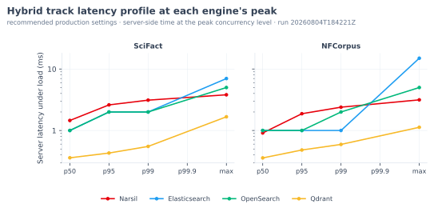
<!-- BENCH:server-hybrid-best-config END -->

### A note on latency

Throughput under concurrent load is the headline speed measure here, because
single-query latency cannot separate these engines at a few thousand documents.
Narsil reports its server-side query time in floating milliseconds, so its
sub-millisecond searches are recorded exactly. Elasticsearch, OpenSearch,
Meilisearch, and Typesense report whole milliseconds, so their sub-millisecond
searches fall below what their own timers can resolve, and the latency charts leave
out the points those timers floor to zero. Weaviate exposes no server-side query
time, so only its client round-trip is recorded and it is absent from the
server-side latency charts. The linked run report carries the full latency tables,
both server-side and client round-trip.

## Embedded search: in-process against Orama and MiniSearch

The same engine also runs as a library inside one Node.js process, with no server
and no network, against Orama and MiniSearch. This is the embedded class, where
Narsil indexes and queries in the same process as your application code. The speed
tiers run on a BEIR corpus, and ranking quality is scored on BEIR SciFact with its
human relevance judgements. All three engines use the same Lucene English stop
words and default BM25 parameters. Each one stems English with its own
implementation, which no shared setting overrides, so a ranking gap between them
carries both the ranking and the stemmer.

<!-- BENCH:inprocess-setup START -->
- **Run.** These figures come from run `20260804T180208Z`, recorded on 2026-08-04 from commit `ad93b7f4fe58`. The full per-scale tables are in [the run report](benchmarks/in-process/results/runs/20260804T180208Z/comparison.md).
- **Engines.** The comparison runs Narsil 0.2.2 against Orama 3.1.18 and MiniSearch 7.2.0, all inside one Node.js process.
- **Threads.** Every engine answers on one thread. Narsil runs with `workers.enabled` off, so it holds no worker copies here, and the server comparison above is where its worker threads take part.
- **Machine.** The run executed on GCP c3-standard-8, us-central1-a, which reports Intel(R) Xeon(R) Platinum 8481C CPU @ 2.70GHz, 31GB of memory, Node.js v24.19.0, and Linux x64.
- **Speed corpus.** The indexing and query tiers run on BEIR FiQA, 50,000 documents, measured at 1,000, 10,000, and 50,000 documents.
- **Relevance dataset.** Ranking quality is scored on BEIR SciFact, 5,183 documents and 300 judged queries, verified by archive checksum `536e14446a0b`.
<!-- BENCH:inprocess-setup END -->

### Ranking quality

<!-- BENCH:inprocess-quality START -->
Ranking quality on BEIR SciFact, higher is better:

| Engine | nDCG@10 | P@10 | MAP | MRR |
| --- | ---: | ---: | ---: | ---: |
| Narsil | 0.6840 | 0.0903 | 0.6355 | 0.6476 |
| Orama | 0.4351 | 0.0657 | 0.3747 | 0.3845 |
| MiniSearch | 0.2506 | 0.0373 | 0.2163 | 0.2198 |
<!-- BENCH:inprocess-quality END -->

### Indexing and query speed

The suite records indexing throughput, query latency, and memory at each corpus
scale, and it measures filtered search where the engine supports it. Memory counts
the JavaScript heap plus the memory the process holds outside it, so a vector an
engine keeps in a typed array or in WebAssembly memory counts the same as one it
keeps as JavaScript objects. Narsil runs this track with `trackPositions: false`,
because the suite measures no feature that reads term positions, and with
`workers.enabled` off, because Orama and MiniSearch answer on one thread and this
table compares one thread. The server comparison above runs Narsil with its
defaults, which keep positions on and hold a worker copy on every thread.

<!-- BENCH:inprocess-speed START -->
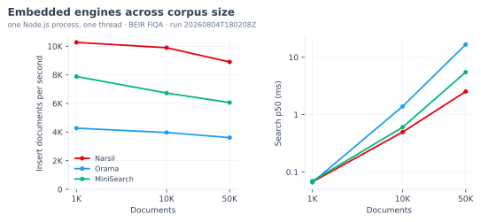

Insert throughput at each scale, documents per second:

| Engine | 1,000 | 10,000 | 50,000 |
| --- | ---: | ---: | ---: |
| Narsil | 10,271 | 9,899 | 8,903 |
| Orama | 4,273 | 3,969 | 3,611 |
| MiniSearch | 7,886 | 6,729 | 6,063 |

Search latency at each scale, p50 milliseconds:

| Engine | 1,000 | 10,000 | 50,000 |
| --- | ---: | ---: | ---: |
| Narsil | 0.067 | 0.497 | 2.522 |
| Orama | 0.066 | 1.391 | 16.622 |
| MiniSearch | 0.070 | 0.603 | 5.486 |

This run recorded no memory figure under the heap plus external definition.

Filtered search latency at 50,000 documents, p50 milliseconds:

| Engine | Filtered search p50 ms |
| --- | ---: |
| Narsil | 0.556 |
| Orama | 8.010 |
| MiniSearch | not supported |
<!-- BENCH:inprocess-speed END -->

### Vector search

Narsil carries vector search in the same embedded engine. MiniSearch has no vector
support, so this tier compares Narsil against Orama.

<!-- BENCH:inprocess-vector START -->
Embedded vector search on BEIR SciFact:

| Engine | Recall@10 | Insert docs/s | Search p50 ms |
| --- | ---: | ---: | ---: |
| Narsil | 100.0% | 113,843 | 2.074 |
| Orama | 100.0% | 165,533 | 3.728 |

Embedded vector search on BEIR NFCorpus:

| Engine | Recall@10 | Insert docs/s | Search p50 ms |
| --- | ---: | ---: | ---: |
| Narsil | 100.0% | 128,931 | 1.471 |
| Orama | 100.0% | 200,559 | 2.581 |
<!-- BENCH:inprocess-vector END -->

## Reproduce these numbers

- **Search servers.** The only requirement is Docker. From `benchmarks/server/`,
  run `./run-all.sh`. The harness builds the Narsil server from this repository,
  embeds every corpus once into a shared cache, runs each engine one at a time
  under equal precision and again under its recommended production settings, and
  writes a fresh run directory under `benchmarks/server/results/runs/`. The
  [server benchmark README](benchmarks/server/README.md) covers the configuration
  and the large-dataset path.
- **Embedded libraries.** From the repository root, run `pnpm build`, then
  `pnpm --filter benchmarks bench`. The
  [in-process benchmark README](benchmarks/in-process/README.md) lists the tiers
  and the single-tier commands.
- **This page.** After a run, `python3 benchmarks/writeup/charts.py` draws every
  figure into the run's own `charts/` directory, and
  `python3 benchmarks/writeup/generate.py` rewrites the tables above from the
  latest recorded run of each suite. `python3 benchmarks/writeup/generate.py
  --check` verifies that the page and its figures match those runs, and
  continuous integration runs the same check.

Absolute numbers move with the hardware, so the value is in the comparison between
engines measured on the same machine in the same run.
