# Narsil benchmarks: one engine, embedded or on a server

Narsil runs two ways from a single codebase. You can embed it inside your
application process like a library, and you can run it as a search server that
scales across machines. This page measures both, because portability is the
goal: the engine that indexes a few thousand documents inside a browser tab is
the same engine that answers queries behind an HTTP API.

Every number and every chart on this page comes from a recorded run. A script
reads the latest run of each suite and fills the tables below from the raw results,
while a second script draws each figure into the run's own directory. A
continuous-integration check fails the build if the page or a figure ever differs
from those recordings. Each section links to the run it came from so you can read
the per-engine detail and reproduce the figures yourself.

In the server and embedded tables, the script marks the best figure in each column
in bold with a star. When two engines tie for the best figure, the script marks
both. The script leaves a column unmarked when every engine has the same figure,
and it marks only the speed figures of engines that reached the recall target.

## Search servers: keyword, vector, and hybrid retrieval

The first comparison runs over HTTP against six production search engines on
[BEIR](https://github.com/beir-cellar/beir) datasets, the datasets and metrics
that the published information-retrieval leaderboards use. Each engine ingests the
corpus, answers the dataset's test queries, writes a TREC run file, and gets
scored with `pytrec_eval`, the same tool the BEIR leaderboard uses. The comparison
runs three tracks. The keyword track scores BM25 ranking. The vector track scores
dense nearest-neighbour search. The hybrid track scores keyword and vector
combined. On the vector and hybrid tracks every engine receives identical
precomputed vectors from one fixed embedding model, so the comparison measures the
index and holds the embedder constant.

Narsil calibrates its BM25 against the Anserini reference configuration, so the
rest of the comparison stands on a trusted baseline. The setup, the pinned engine
versions, and the datasets all come from the recorded run.

<!-- BENCH:server-setup START -->
- **Run.** These figures come from run `20261119T135007Z`, recorded on 2026-11-19 from commit `3ad47df2c9c1`. The raw per-engine results and the full comparison are in [the run report](benchmarks/server/results/runs/20261119T135007Z/comparison.md).
- **Datasets.** The harness measured SciFact (5,183 documents), NFCorpus (3,633 documents), DBpedia entities 100K (100,000 documents), and DBpedia entities 1M (995,000 documents). SciFact is loaded and hash-verified through `ir_datasets`, with sentence-transformers/all-MiniLM-L6-v2 vectors at 384 dimensions; NFCorpus is loaded and hash-verified through `ir_datasets`, with sentence-transformers/all-MiniLM-L6-v2 vectors at 384 dimensions; DBpedia entities 100K is read from a published dataset artifact pinned by its SHA-256, with text-embedding-ada-002 vectors at 1,536 dimensions; DBpedia entities 1M is read from a published dataset artifact pinned by its SHA-256, with text-embedding-ada-002 vectors at 1,536 dimensions.
- **Engines.** The comparison runs Narsil TypeScript 0.4.5 and Narsil Rust 0.4.5 against Elasticsearch 9.5.6, Meilisearch 1.57.0, OpenSearch 3.10.0, Qdrant 1.20.2, Typesense 30.2, and Weaviate 1.40.5, and every engine runs from a pinned image.
- **Equal conditions.** Every engine receives the same 20 GiB memory cap, the same run depth of 1,000, and the same run-file ordering. The harness tests one engine at a time, so each engine has the machine to itself. Each Java engine divides that cap between its heap and the memory outside it. Elasticsearch reports a 10 GiB heap and OpenSearch reports a 6 GiB heap. The Narsil TypeScript server reports that its V8 heap can grow to 15 GiB inside that cap.
- **Load.** The harness measures throughput at 1, 2, 4, 8, 16, 32, 64, and 128 concurrent clients, with one pass per level and 3 passes at each engine's peak level. The tables report the median peak pass with a 95% bootstrap interval. The load generator works on a separate machine from the engine under test, so its client processes take no CPU time from the engine, and it spreads the clients across 8 processes. The harness measures every engine under that same arrangement. After it loads each large dataset, the harness waits until the engine uses less than 0.5 cores for 5 seconds in a row, so that the merges, graph builds, and index copies that an engine starts after a load finish before any measurement. The longest wait was 87 seconds, for Narsil on DBpedia entities 1M.
- **Narsil TypeScript threads.** Narsil TypeScript started at the engine defaults, and the harness read 9 worker threads, 8 request threads receiving requests, and the benchmark index scaled out across them.
- **Narsil TypeScript vector search.** The Narsil TypeScript server reports that it searches vector graphs through its native search core in C, which npm installs with the package on Node.js for macOS, Linux, and Windows.
- **Machine.** The engines ran on 8 machines: Narsil TypeScript on GCP c3-standard-8, us-central1-a, which reports Intel(R) Xeon(R) Platinum 8481C CPU @ 2.70GHz and Linux 7.0.0-1017-gcp x86_64, Narsil Rust on GCP c3-standard-8, us-east1-b, which reports Intel(R) Xeon(R) Platinum 8481C CPU @ 2.70GHz and Linux 7.0.0-1017-gcp x86_64, Elasticsearch on GCP c3-standard-8, us-east4-a, which reports Intel(R) Xeon(R) Platinum 8481C CPU @ 2.70GHz and Linux 7.0.0-1017-gcp x86_64, Meilisearch on GCP c3-standard-8, us-south1-b, which reports Intel(R) Xeon(R) Platinum 8481C CPU @ 2.70GHz and Linux 7.0.0-1017-gcp x86_64, OpenSearch on GCP c3-standard-8, us-west1-a, which reports Intel(R) Xeon(R) Platinum 8481C CPU @ 2.70GHz and Linux 7.0.0-1017-gcp x86_64, Qdrant on GCP c3-standard-8, us-west4-a, which reports Intel(R) Xeon(R) Platinum 8481C CPU @ 2.70GHz and Linux 7.0.0-1017-gcp x86_64, Typesense on GCP c3-standard-8, us-west2-a, which reports Intel(R) Xeon(R) Platinum 8481C CPU @ 2.70GHz and Linux 7.0.0-1017-gcp x86_64, and Weaviate on GCP c3-standard-8, us-west3-b, which reports Intel(R) Xeon(R) Platinum 8481C CPU @ 2.70GHz and Linux 7.0.0-1017-gcp x86_64.
- **BM25 calibration.** Narsil indexes each corpus with BM25 k1=0.9 and b=0.4, the Anserini reference configuration.
<!-- BENCH:server-setup END -->

Each track below opens with two bar charts per dataset, ranking quality and peak
throughput, followed by the table behind them. Where a run measured more than one
concurrency level, a line chart then follows each engine across those levels, and
the setup block above says which levels a run measured. A latency profile at the
end of the track shows how far each engine's tail stretches at its own peak. That
under-load latency comes from the throughput passes, because their five-second
windows hold several times more samples than the serial track, so p99.9 rests on
more than the slowest one or two requests.

### Keyword track

Narsil's BM25 is calibrated to the Anserini reference, so it ranks with the
Lucene engines on these graded judgements. Typesense and Meilisearch apply their
own documented ranking models in place of BM25, which places them lower here.

The nDCG@10 rank in each table that lists nDCG@10 is one more than the number
of engines that score significantly higher. A two-sided paired randomization
test compares every pair of engines over the per-query nDCG@10 of every judged
query, with 10,000 permutations, and Holm's correction holds the whole table to
a 5% error rate, so engines that share a rank are statistically tied.

<!-- BENCH:server-keyword START -->
#### SciFact

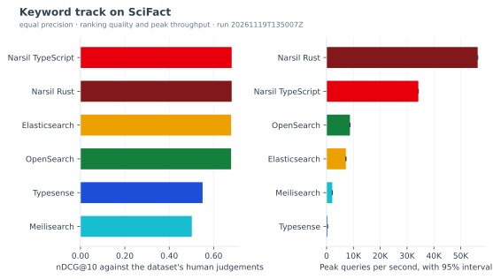

| Engine | nDCG@10 | nDCG@10 rank | Recall@100 | MAP | MRR | Peak QPS |
| --- | ---: | ---: | ---: | ---: | ---: | ---: |
| Narsil TypeScript | **0.6814**\* | 1 | **0.9253**\* | **0.6417**\* | 0.6494 | 34,198 (34,169 to 34,213) |
| Narsil Rust | **0.6814**\* | 1 | **0.9253**\* | **0.6417**\* | 0.6494 | **56,315**\* (56,271 to 56,361) |
| Elasticsearch | 0.6789 | 1 | **0.9253**\* | 0.6401 | **0.6506**\* | 7,208 (7,191 to 7,237) |
| OpenSearch | 0.6789 | 1 | **0.9253**\* | 0.6401 | **0.6506**\* | 8,713 (8,667 to 8,734) |
| Typesense | 0.5503 | 5 | 0.7508 | 0.5164 | 0.5280 | 333 (330 to 334) |
| Meilisearch | 0.5019 | 5 | 0.5982 | 0.4823 | 0.4903 | 2,124 (2,114 to 2,174) |

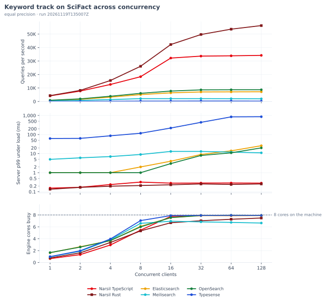

#### NFCorpus

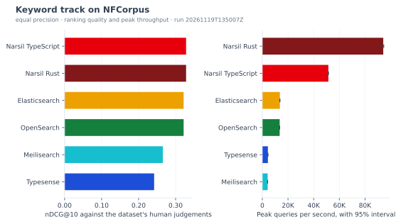

| Engine | nDCG@10 | nDCG@10 rank | Recall@100 | MAP | MRR | Peak QPS |
| --- | ---: | ---: | ---: | ---: | ---: | ---: |
| Narsil TypeScript | **0.3283**\* | 1 | **0.2489**\* | **0.1535**\* | **0.5336**\* | 51,462 (51,319 to 51,564) |
| Narsil Rust | **0.3283**\* | 1 | **0.2489**\* | **0.1535**\* | **0.5336**\* | **94,225**\* (93,724 to 94,639) (client-limited) |
| Elasticsearch | 0.3217 | 1 | 0.2457 | 0.1503 | 0.5274 | 13,682 (13,677 to 13,711) |
| OpenSearch | 0.3217 | 1 | 0.2457 | 0.1503 | 0.5274 | 13,527 (13,524 to 13,537) |
| Meilisearch | 0.2654 | 5 | 0.1554 | 0.1214 | 0.4415 | 4,166 (4,156 to 4,196) |
| Typesense | 0.2420 | 5 | 0.2089 | 0.1171 | 0.4242 | 4,355 (4,333 to 4,364) |

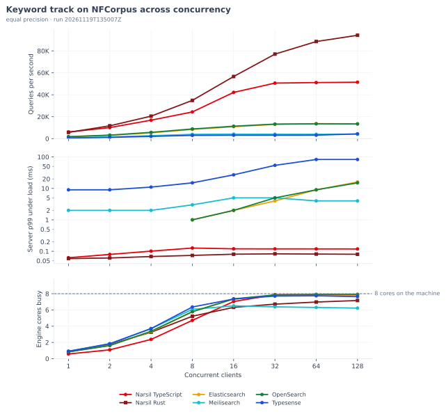

#### DBpedia entities 100K

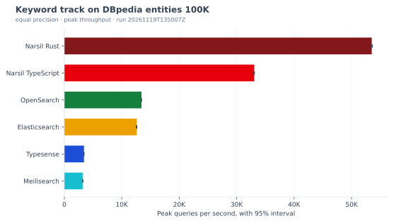

| Engine | Peak QPS |
| --- | ---: |
| Narsil Rust | **53,510**\* (53,422 to 53,637) |
| Narsil TypeScript | 33,054 (32,983 to 33,102) |
| OpenSearch | 13,435 (13,356 to 13,461) |
| Elasticsearch | 12,613 (12,538 to 12,641) |
| Typesense | 3,429 (3,426 to 3,438) |
| Meilisearch | 3,206 (3,205 to 3,237) |

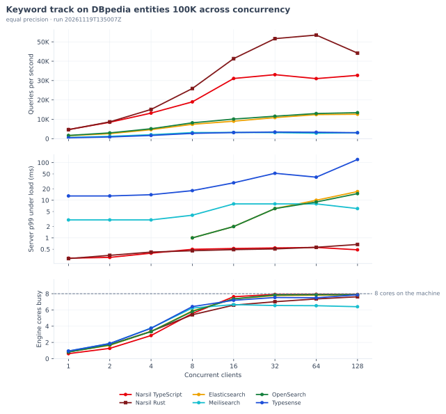

#### DBpedia entities 1M

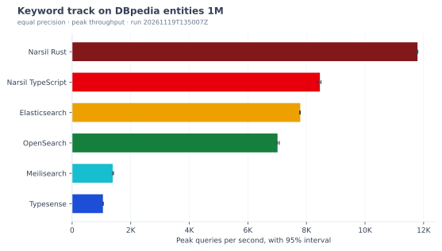

| Engine | Peak QPS |
| --- | ---: |
| Narsil Rust | **11,792**\* (11,749 to 11,803) |
| Narsil TypeScript | 8,459 (8,380 to 8,498) |
| Elasticsearch | 7,789 (7,766 to 7,792) |
| OpenSearch | 7,013 (6,997 to 7,073) |
| Meilisearch | 1,387 (1,383 to 1,414) |
| Typesense | 1,052 (1,048 to 1,067) |

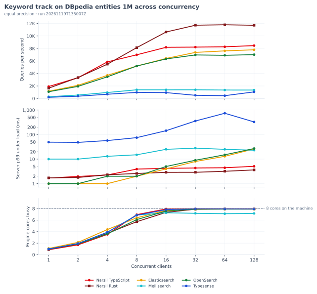

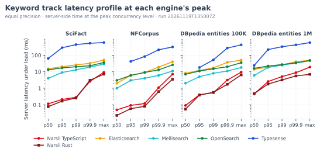
<!-- BENCH:server-keyword END -->

### Vector track

Every engine indexes the identical vectors and tunes its search effort up to the
same matched recall point against the exact nearest neighbours. Retrieval quality
is therefore equal across engines by construction, so this track compares speed at
that point. The throughput differences at a few thousand vectors reflect
per-request handling at this corpus size, since every engine sits near full recall
at a modest search effort. Where the run recorded throughput at every step of the
recall sweep, a further chart draws queries per second against recall, so you can
see how much throughput each engine gives up for the last point of recall.

Every engine finishes building its index before the timed searches start. At that
point Elasticsearch and OpenSearch also merge each index into a single segment,
which [Elastic advises only for an index that takes no more writes](https://www.elastic.co/guide/en/elasticsearch/reference/8.18/tune-knn-search.html),
and that merge counts towards their ingest time. The vector and hybrid figures
therefore describe an index that is loaded once and then searched, and no track
measures search while writes arrive.

<!-- BENCH:server-vector START -->
On SciFact, every engine tunes its search effort to reach ann_recall@10 of at least 0.99 against the exact neighbours, and each returns the same ranking, so nDCG@10 is 0.6239 and Recall@100 is 0.9227 across the field. On NFCorpus, every engine tunes its search effort to reach ann_recall@10 of at least 0.99 against the exact neighbours. The tables report each engine's measured ranking quality. On DBpedia entities 100K, every engine tunes its search effort to reach ann_recall@10 of at least 0.99 against the exact neighbours. The set carries no relevance judgements, so it reports recall, latency, and throughput and no ranking quality. On DBpedia entities 1M, every engine tunes its search effort to reach ann_recall@10 of at least 0.99 against the exact neighbours. The set carries no relevance judgements, so it reports recall, latency, and throughput and no ranking quality.

#### SciFact

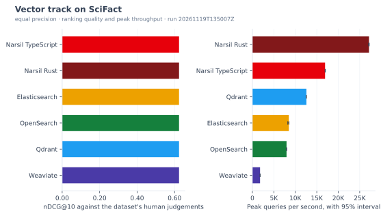

| Engine | Search effort | ANN recall@10 | Peak QPS |
| --- | --- | ---: | ---: |
| Narsil Rust | efSearch 64 | 0.9960 | **27,162**\* (27,054 to 27,221) |
| Narsil TypeScript | efSearch 64 | 0.9960 | 16,931 (16,925 to 16,999) |
| Qdrant | hnsw_ef 32 | 0.9923 | 12,585 (12,514 to 12,588) |
| Elasticsearch | num_candidates 64 | 0.9943 | 8,493 (8,246 to 8,527) |
| OpenSearch | ef_search 64 | 0.9973 | 7,957 (7,946 to 7,980) |
| Weaviate | ef 64 | 0.9967 | 1,788 (1,788 to 1,791) |

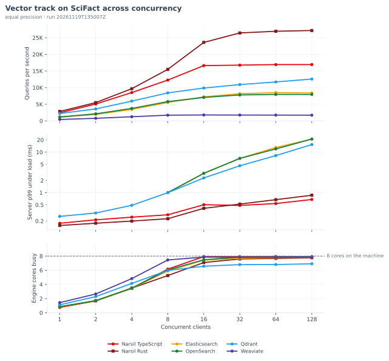

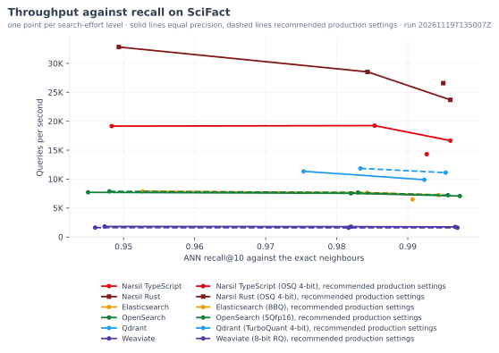

#### NFCorpus

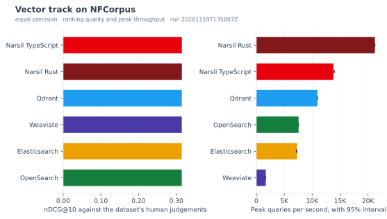

| Engine | Search effort | ANN recall@10 | Peak QPS |
| --- | --- | ---: | ---: |
| Narsil Rust | efSearch 128 | 0.9910 | **21,238**\* (21,167 to 21,265) |
| Narsil TypeScript | efSearch 128 | 0.9944 | 13,799 (13,794 to 14,027) |
| Qdrant | hnsw_ef 64 | 0.9935 | 10,937 (10,928 to 10,957) |
| OpenSearch | ef_search 128 | 0.9950 | 7,563 (7,551 to 7,567) |
| Elasticsearch | num_candidates 192 | 0.9901 | 7,288 (7,138 to 7,290) |
| Weaviate | ef 160 | 0.9932 | 1,684 (1,681 to 1,689) |

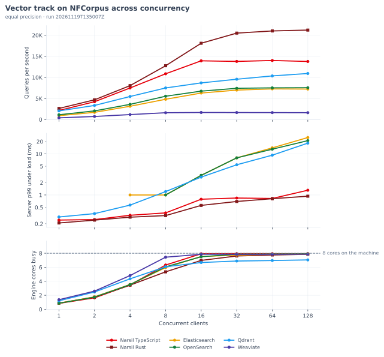

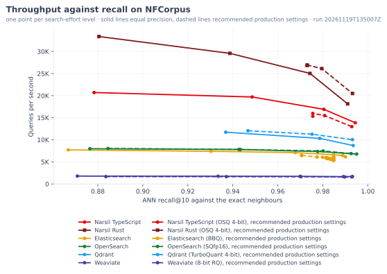

#### DBpedia entities 100K

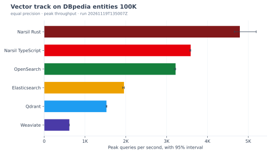

| Engine | Search effort | ANN recall@10 | Peak QPS |
| --- | --- | ---: | ---: |
| Narsil Rust | efSearch 128 | 0.9914 | **4,794**\* (4,660 to 5,195) |
| Narsil TypeScript | efSearch 128 | 0.9915 | 3,589 (3,567 to 3,592) |
| OpenSearch | ef_search 128 | 0.9916 | 3,219 (3,188 to 3,222) |
| Elasticsearch | num_candidates 768 | 0.9917 | 1,955 (1,921 to 1,965) |
| Qdrant | hnsw_ef 128 | 0.9946 | 1,525 (1,517 to 1,536) |
| Weaviate | ef 160 | 0.9917 | 616 (615 to 617) |

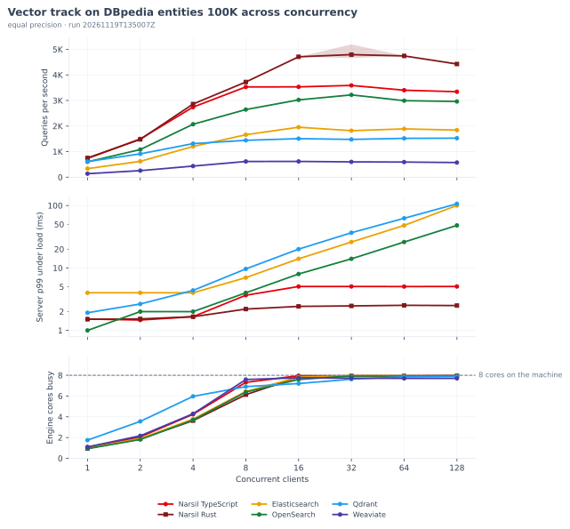

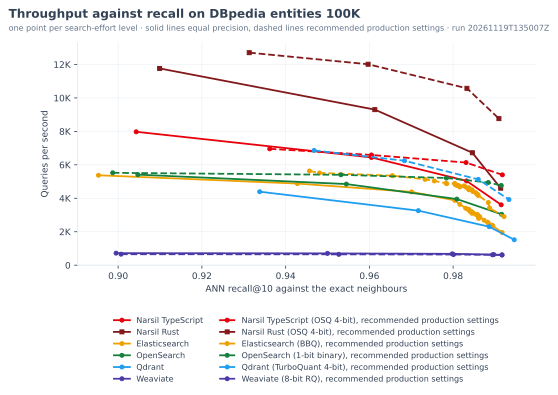

#### DBpedia entities 1M

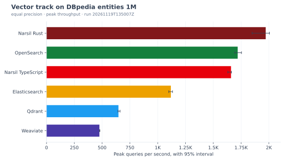

| Engine | Search effort | ANN recall@10 | Peak QPS |
| --- | --- | ---: | ---: |
| Narsil Rust | efSearch 264 | 0.9920 | **1,971**\* (1,849 to 2,005) |
| OpenSearch | ef_search 248 | 0.9913 | 1,719 (1,694 to 1,753) |
| Narsil TypeScript | efSearch 280 | 0.9920 | 1,659 (1,631 to 1,663) |
| Elasticsearch | num_candidates 1536 | 0.9911 | 1,118 (1,100 to 1,133) |
| Qdrant | hnsw_ef 192 | 0.9927 | 647 (643 to 661) |
| Weaviate | ef 416 | 0.9927 | 476 (476 to 480) |

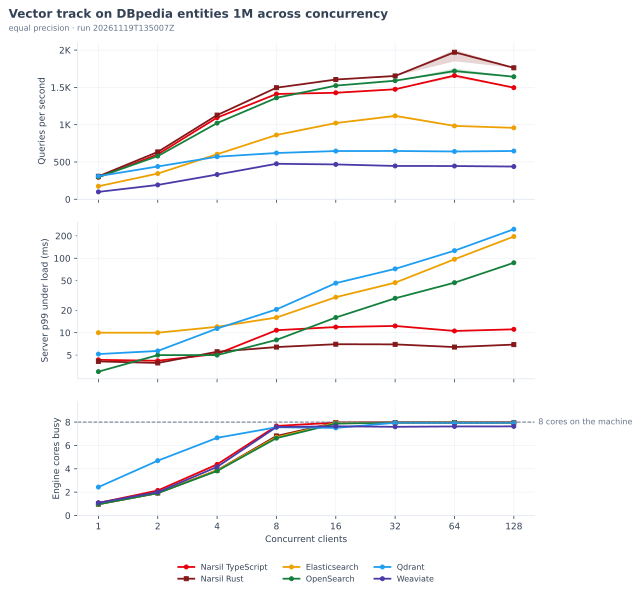

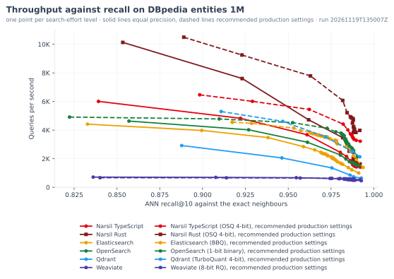

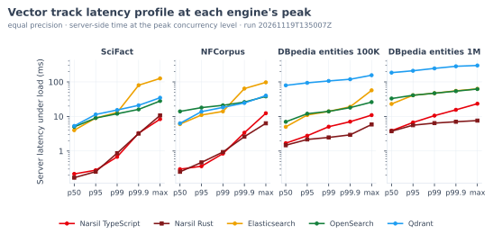
<!-- BENCH:server-vector END -->

### Hybrid track

Hybrid fusion combines the keyword and vector rankings, and the fusion method
differs per engine, so ranking quality varies again.

<!-- BENCH:server-hybrid START -->
#### SciFact

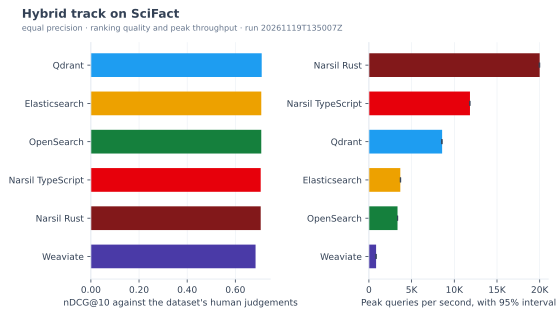

| Engine | nDCG@10 | nDCG@10 rank | Recall@100 | MAP | MRR | Peak QPS |
| --- | ---: | ---: | ---: | ---: | ---: | ---: |
| Qdrant | **0.7095**\* | 1 | 0.9577 | **0.6661**\* | **0.6700**\* | 8,575 (8,521 to 8,575) |
| Elasticsearch | 0.7078 | 1 | 0.9610 | 0.6620 | 0.6676 | 3,678 (3,673 to 3,721) |
| OpenSearch | 0.7077 | 1 | 0.9610 | 0.6619 | 0.6676 | 3,352 (3,347 to 3,371) |
| Narsil TypeScript | 0.7054 | 1 | **0.9643**\* | 0.6581 | 0.6648 | 11,835 (11,798 to 11,838) |
| Narsil Rust | 0.7054 | 1 | **0.9643**\* | 0.6581 | 0.6648 | **19,998**\* (19,936 to 20,005) |
| Weaviate | 0.6840 | 1 | 0.9577 | 0.6366 | 0.6460 | 842 (840 to 843) |

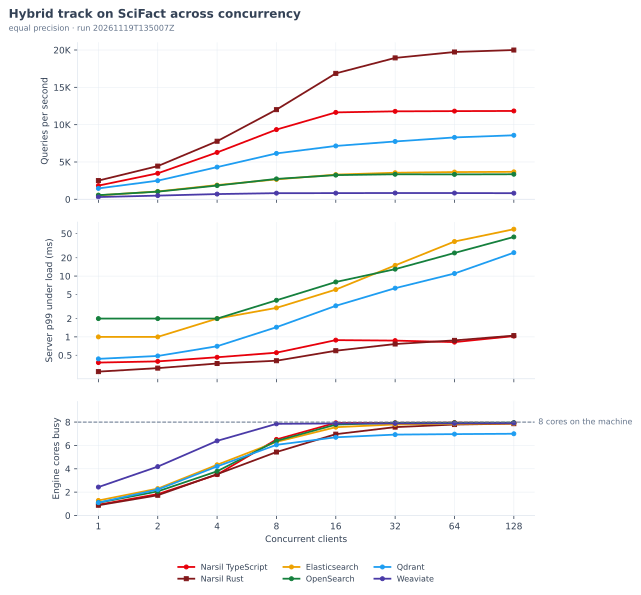

#### NFCorpus

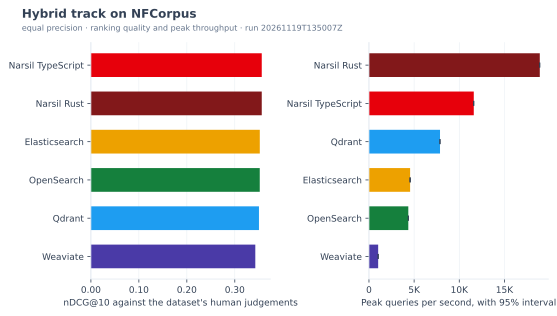

| Engine | nDCG@10 | nDCG@10 rank | Recall@100 | MAP | MRR | Peak QPS |
| --- | ---: | ---: | ---: | ---: | ---: | ---: |
| Narsil TypeScript | **0.3562**\* | 1 | **0.3238**\* | **0.1877**\* | **0.5759**\* | 11,604 (11,578 to 11,613) |
| Narsil Rust | **0.3562**\* | 1 | **0.3238**\* | **0.1877**\* | **0.5759**\* | **18,913**\* (18,884 to 18,916) |
| Elasticsearch | 0.3522 | 3 | 0.3215 | 0.1867 | 0.5648 | 4,555 (4,523 to 4,585) |
| OpenSearch | 0.3521 | 3 | 0.3213 | 0.1867 | 0.5633 | 4,356 (4,351 to 4,365) |
| Qdrant | 0.3504 | 1 | 0.3236 | 0.1826 | 0.5703 | 7,866 (7,854 to 7,870) |
| Weaviate | 0.3428 | 3 | 0.3195 | 0.1810 | 0.5548 | 1,019 (1,018 to 1,020) |

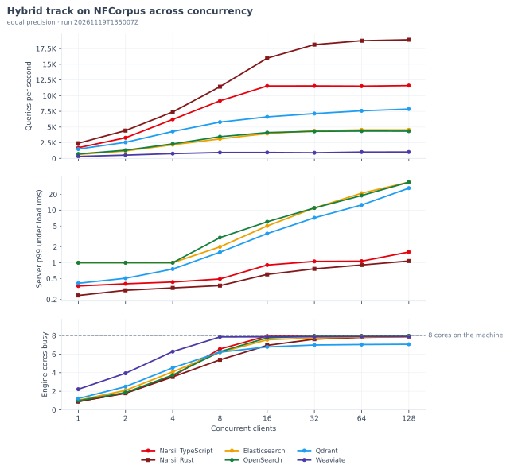

#### DBpedia entities 100K

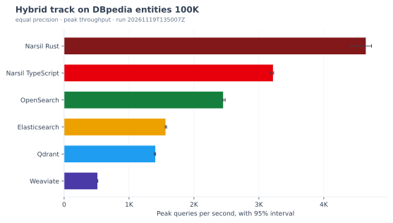

| Engine | Peak QPS |
| --- | ---: |
| Narsil Rust | **4,647**\* (4,423 to 4,736) |
| Narsil TypeScript | 3,218 (3,172 to 3,228) |
| OpenSearch | 2,449 (2,445 to 2,481) |
| Elasticsearch | 1,562 (1,558 to 1,579) |
| Qdrant | 1,404 (1,389 to 1,410) |
| Weaviate | 513 (509 to 520) |

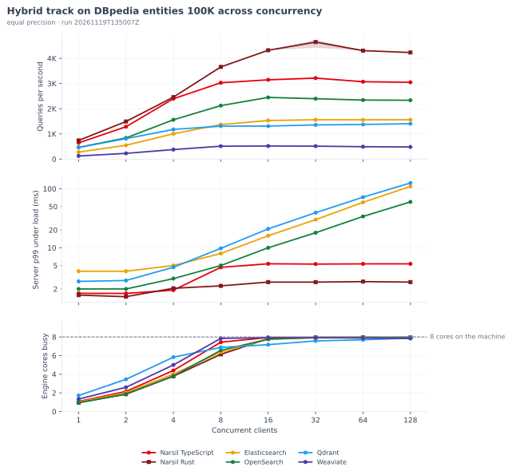

#### DBpedia entities 1M

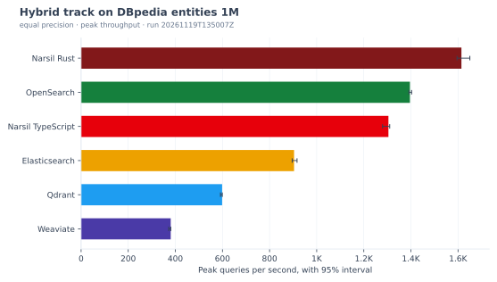

| Engine | Peak QPS |
| --- | ---: |
| Narsil Rust | **1,614**\* (1,596 to 1,650) |
| OpenSearch | 1,396 (1,392 to 1,403) |
| Narsil TypeScript | 1,304 (1,280 to 1,310) |
| Elasticsearch | 904 (896 to 917) |
| Qdrant | 599 (592 to 599) |
| Weaviate | 380 (372 to 381) |

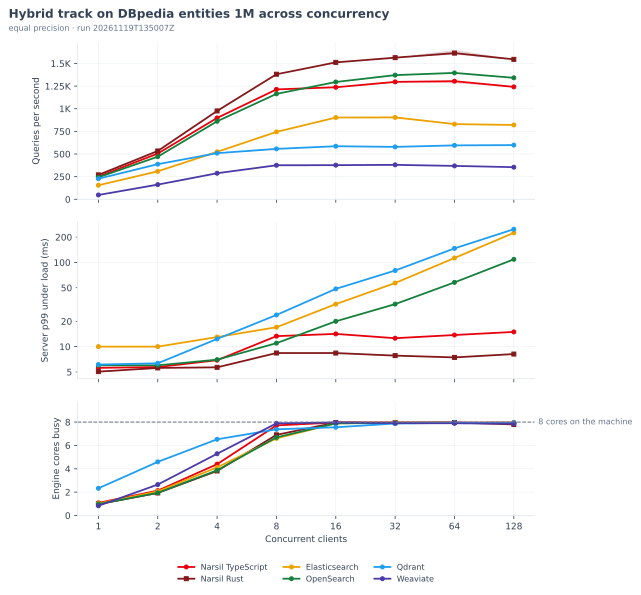

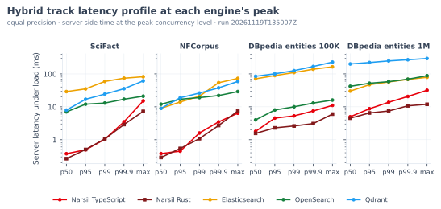
<!-- BENCH:server-hybrid END -->

### Recommended production settings

The tracks above hold every engine at full float so that the comparison isolates
the index. Each engine also recommends a quantisation for production, and this
second pass runs the vector and hybrid tracks under those settings. The tables name
the quantisation each engine applied once a run records it. Every engine still
tunes its search effort to the same recall target, so compression differs by engine
on purpose while the accuracy bar stays fixed. The equal-precision figures above
remain the headline.

### Vector track at production settings

<!-- BENCH:server-vector-best-config START -->
#### SciFact

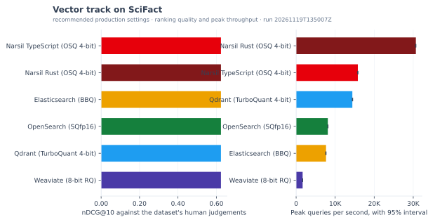

| Engine | Search effort | ANN recall@10 | Peak QPS |
| --- | --- | ---: | ---: |
| Narsil Rust (OSQ 4-bit) | efSearch 16 | 0.9950 | **30,671**\* (30,602 to 30,696) |
| Narsil TypeScript (OSQ 4-bit) | efSearch 16 | 0.9927 | 15,809 (15,756 to 15,840) |
| Qdrant (TurboQuant 4-bit) | hnsw_ef 32 | 0.9953 | 14,400 (14,381 to 14,497) |
| OpenSearch (SQfp16) | ef_search 64 | 0.9957 | 8,117 (8,113 to 8,180) |
| Elasticsearch (BBQ) | num_candidates 16 | 0.9907 | 7,656 (7,553 to 7,680) |
| Weaviate (8-bit RQ) | ef 64 | 0.9970 | 1,663 (1,653 to 1,667) |

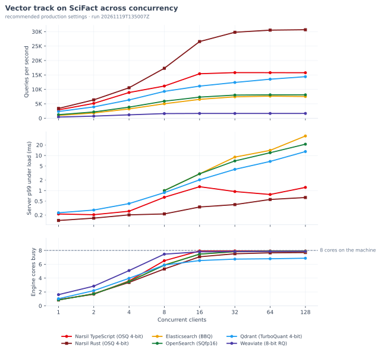

#### NFCorpus

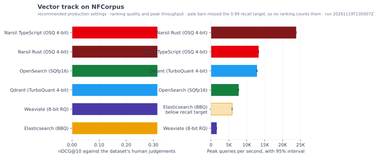

| Engine | Search effort | ANN recall@10 | Peak QPS |
| --- | --- | ---: | ---: |
| Narsil Rust (OSQ 4-bit) | efSearch 128 | 0.9932 | **23,795**\* (23,768 to 23,836) |
| Narsil TypeScript (OSQ 4-bit) | efSearch 128 | 0.9929 | 13,309 (13,273 to 13,336) |
| Qdrant (TurboQuant 4-bit) | hnsw_ef 64 | 0.9932 | 12,855 (12,847 to 12,877) |
| OpenSearch (SQfp16) | ef_search 128 | 0.9926 | 7,743 (7,685 to 7,763) |
| Elasticsearch (BBQ) | num_candidates 8192 | 0.9848 | 5,917 (5,892 to 5,918) |
| Weaviate (8-bit RQ) | ef 160 | 0.9929 | 1,606 (1,605 to 1,606) |

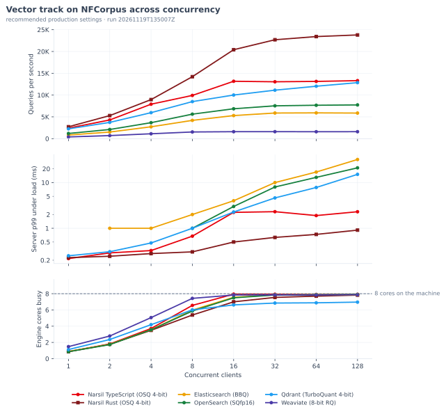

#### DBpedia entities 100K

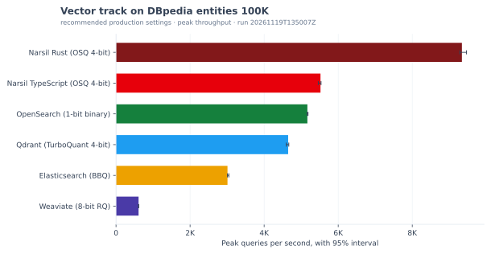

| Engine | Search effort | ANN recall@10 | Peak QPS |
| --- | --- | ---: | ---: |
| Narsil Rust (OSQ 4-bit) | efSearch 128 | 0.9909 | **9,341**\* (9,285 to 9,465) |
| Narsil TypeScript (OSQ 4-bit) | efSearch 128 | 0.9918 | 5,522 (5,462 to 5,536) |
| OpenSearch (1-bit binary) | ef_search 160 | 0.9915 | 5,168 (5,160 to 5,185) |
| Qdrant (TurboQuant 4-bit) | hnsw_ef 128 | 0.9933 | 4,648 (4,600 to 4,666) |
| Elasticsearch (BBQ) | num_candidates 1536 | 0.9922 | 3,010 (3,009 to 3,046) |
| Weaviate (8-bit RQ) | ef 160 | 0.9917 | 609 (608 to 609) |

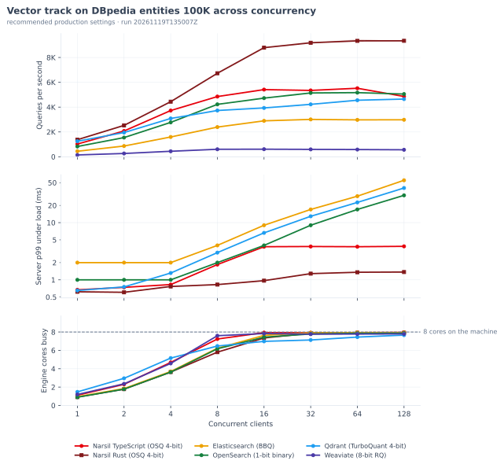

#### DBpedia entities 1M

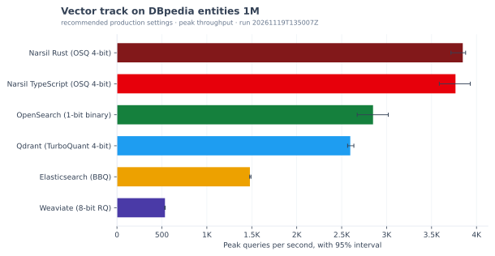

| Engine | Search effort | ANN recall@10 | Peak QPS |
| --- | --- | ---: | ---: |
| Narsil Rust (OSQ 4-bit) | efSearch 296 | 0.9918 | **3,847**\* (3,716 to 3,879) |
| Narsil TypeScript (OSQ 4-bit) | efSearch 256 | 0.9921 | 3,766 (3,586 to 3,931) |
| OpenSearch (1-bit binary) | ef_search 768 | 0.9904 | 2,849 (2,673 to 3,018) |
| Qdrant (TurboQuant 4-bit) | hnsw_ef 160 | 0.9918 | 2,596 (2,566 to 2,636) |
| Elasticsearch (BBQ) | num_candidates 4096 | 0.9937 | 1,479 (1,476 to 1,491) |
| Weaviate (8-bit RQ) | ef 384 | 0.9921 | 534 (531 to 537) |

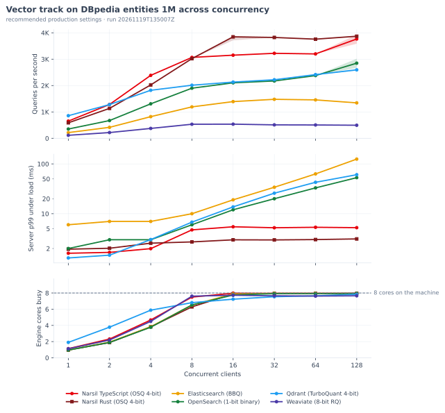

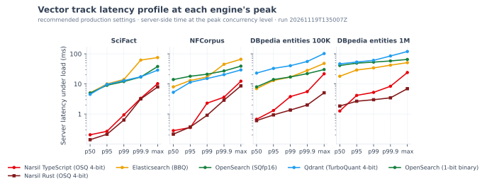
<!-- BENCH:server-vector-best-config END -->

### Hybrid track at production settings

<!-- BENCH:server-hybrid-best-config START -->
#### SciFact

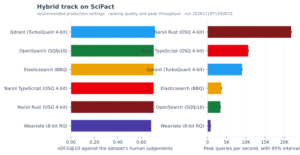

| Engine | nDCG@10 | nDCG@10 rank | Recall@100 | MAP | MRR | Peak QPS |
| --- | ---: | ---: | ---: | ---: | ---: | ---: |
| Qdrant (TurboQuant 4-bit) | **0.7157**\* | 1 | 0.9577 | **0.6744**\* | **0.6784**\* | 8,973 (8,956 to 8,974) |
| OpenSearch (SQfp16) | 0.7064 | 1 | 0.9610 | 0.6599 | 0.6665 | 3,353 (3,342 to 3,362) |
| Elasticsearch (BBQ) | 0.7059 | 1 | 0.9610 | 0.6592 | 0.6660 | 3,610 (3,586 to 3,619) |
| Narsil TypeScript (OSQ 4-bit) | 0.7054 | 1 | **0.9643**\* | 0.6581 | 0.6648 | 10,572 (10,571 to 10,709) |
| Narsil Rust (OSQ 4-bit) | 0.7054 | 1 | **0.9643**\* | 0.6581 | 0.6648 | **21,782**\* (21,769 to 21,888) |
| Weaviate (8-bit RQ) | 0.6840 | 1 | 0.9577 | 0.6366 | 0.6460 | 781 (779 to 792) |

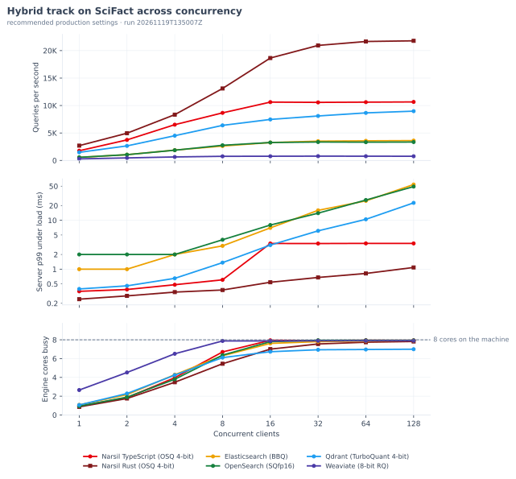

#### NFCorpus

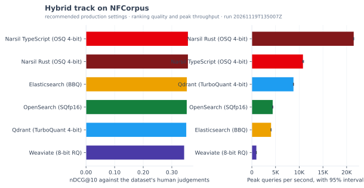

| Engine | nDCG@10 | nDCG@10 rank | Recall@100 | MAP | MRR | Peak QPS |
| --- | ---: | ---: | ---: | ---: | ---: | ---: |
| Narsil TypeScript (OSQ 4-bit) | **0.3562**\* | 1 | **0.3238**\* | **0.1877**\* | **0.5759**\* | 10,784 (10,711 to 10,926) |
| Narsil Rust (OSQ 4-bit) | **0.3562**\* | 1 | **0.3238**\* | **0.1877**\* | **0.5759**\* | **21,494**\* (21,487 to 21,504) |
| Elasticsearch (BBQ) | 0.3525 | 1 | 0.3215 | 0.1868 | 0.5666 | 4,056 (4,051 to 4,057) |
| OpenSearch (SQfp16) | 0.3521 | 3 | 0.3216 | 0.1865 | 0.5638 | 4,395 (4,347 to 4,435) |
| Qdrant (TurboQuant 4-bit) | 0.3504 | 1 | 0.3236 | 0.1824 | 0.5662 | 8,783 (8,782 to 8,784) |
| Weaviate (8-bit RQ) | 0.3431 | 3 | 0.3194 | 0.1809 | 0.5562 | 953 (952 to 955) |

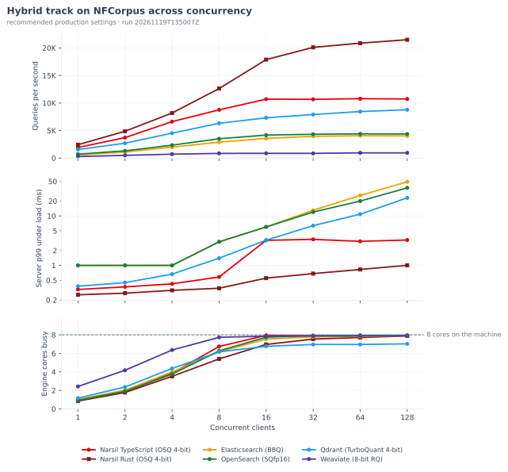

#### DBpedia entities 100K

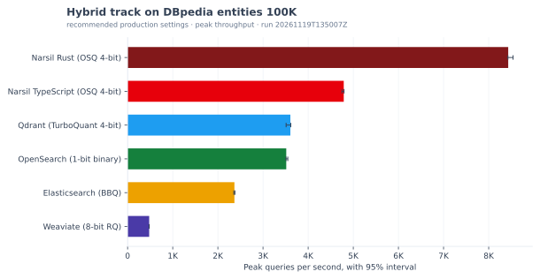

| Engine | Peak QPS |
| --- | ---: |
| Narsil Rust (OSQ 4-bit) | **8,433**\* (8,425 to 8,540) |
| Narsil TypeScript (OSQ 4-bit) | 4,789 (4,749 to 4,795) |
| Qdrant (TurboQuant 4-bit) | 3,606 (3,512 to 3,616) |
| OpenSearch (1-bit binary) | 3,515 (3,508 to 3,549) |
| Elasticsearch (BBQ) | 2,367 (2,353 to 2,377) |
| Weaviate (8-bit RQ) | 478 (477 to 479) |

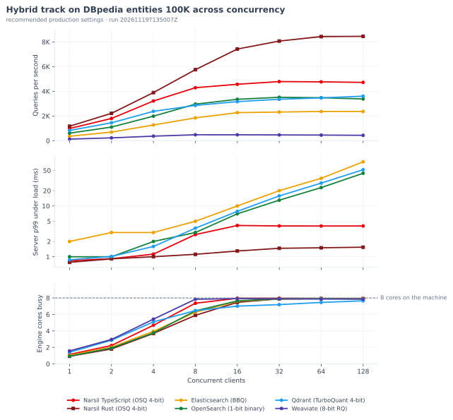

#### DBpedia entities 1M

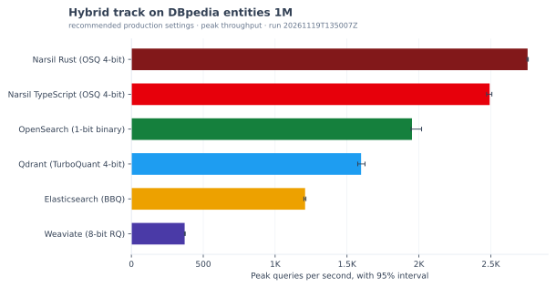

| Engine | Peak QPS |
| --- | ---: |
| Narsil Rust (OSQ 4-bit) | **2,756**\* (2,752 to 2,761) |
| Narsil TypeScript (OSQ 4-bit) | 2,492 (2,471 to 2,508) |
| OpenSearch (1-bit binary) | 1,952 (1,945 to 2,019) |
| Qdrant (TurboQuant 4-bit) | 1,598 (1,575 to 1,625) |
| Elasticsearch (BBQ) | 1,208 (1,200 to 1,214) |
| Weaviate (8-bit RQ) | 371 (369 to 374) |

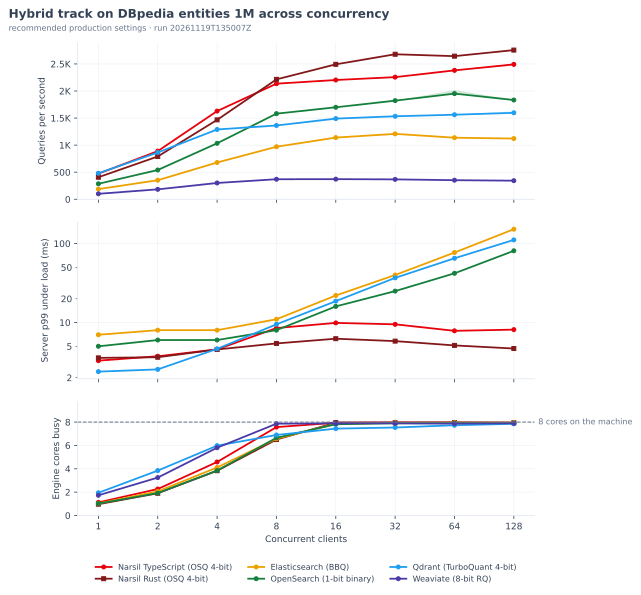

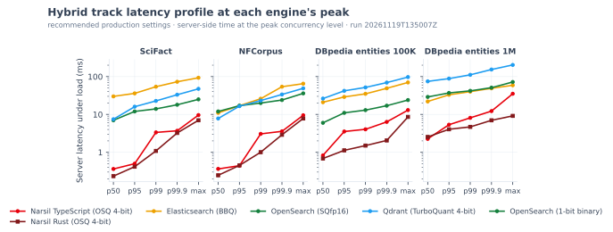
<!-- BENCH:server-hybrid-best-config END -->

### A note on latency

Throughput under concurrent load is the headline speed measure here, because
single-query latency cannot separate these engines at a few thousand documents.
Narsil reports its server-side query time in floating milliseconds, so its
sub-millisecond searches are recorded exactly. Elasticsearch, OpenSearch,
Meilisearch, and Typesense report whole milliseconds, so their sub-millisecond
searches fall below what their own timers can resolve, and the latency charts leave
out the points those timers floor to zero. Weaviate exposes no server-side query
time, so only its client round-trip is recorded and it is absent from the
server-side latency charts. The linked run report carries the full latency tables,
both server-side and client round-trip.

## Embedded search: in-process against Orama and MiniSearch

The same engine also runs as a library inside one Node.js process, with no server
and no network, against Orama and MiniSearch. This is the embedded class, where
Narsil indexes and queries in the same process as your application code. The speed
tiers run on a BEIR corpus, and ranking quality is scored on BEIR SciFact with its
human relevance judgements. All three engines use the same Lucene English stop
words and default BM25 parameters. Each one stems English with its own
implementation, which no shared setting overrides, so a ranking gap between them
carries both the ranking and the stemmer.

<!-- BENCH:inprocess-setup START -->
- **Run.** These figures come from run `20261119T135657Z`, recorded on 2026-11-19 from commit `3ad47df2c9c1`. The full per-scale tables are in [the run report](benchmarks/in-process/results/runs/20261119T135657Z/comparison.md).
- **Engines.** The comparison runs Narsil 0.4.5 against Orama 3.1.18 and MiniSearch 7.2.0, all inside one Node.js process.
- **Threads.** Every engine answers on one thread. Narsil runs with `workers.enabled` off, so it holds no worker copies here, and the server comparison above is where its worker threads take part.
- **Vector search path.** Narsil searches vector graphs through WebAssembly in this suite, which is the path that it takes in a browser. The suite sets `NARSIL_SEARCH_BACKEND=wasm`, so these figures exclude the native search core that npm installs with the package on Node.js.
- **Machine.** GCP c3-standard-8, us-central1-a hosted this run, and it reports Intel(R) Xeon(R) Platinum 8481C CPU @ 2.70GHz, 31GB of memory, Node.js v24.22.3, and Linux x64.
- **Speed corpus.** The indexing and query tiers run on BEIR FiQA, 50,000 documents, measured at 1,000, 10,000, and 50,000 documents.
- **Relevance dataset.** Ranking quality is scored on BEIR SciFact, 5,183 documents and 300 judged queries, verified by archive checksum `536e14446a0b`.
<!-- BENCH:inprocess-setup END -->

### Ranking quality

<!-- BENCH:inprocess-quality START -->
Ranking quality on BEIR SciFact, higher is better:

| Engine | nDCG@10 | P@10 | MAP | MRR |
| --- | ---: | ---: | ---: | ---: |
| Narsil | **0.6840**\* | **0.0903**\* | **0.6355**\* | **0.6476**\* |
| Orama | 0.4351 | 0.0657 | 0.3747 | 0.3845 |
| MiniSearch | 0.2506 | 0.0373 | 0.2163 | 0.2198 |
<!-- BENCH:inprocess-quality END -->

### Indexing and query speed

The suite records indexing throughput, query latency, and memory at each corpus
scale, and it measures filtered search where the engine supports it. Memory counts
the JavaScript heap plus the memory the process holds outside it, so a vector an
engine keeps in a typed array or in WebAssembly memory counts the same as one it
keeps as JavaScript objects. Narsil runs this track with `trackPositions: false`,
because the suite measures no feature that reads term positions, and with
`workers.enabled` off, because Orama and MiniSearch answer on one thread and this
table compares one thread. The server comparison above runs Narsil with its
defaults, which keep positions on and hold a worker copy on every thread.

<!-- BENCH:inprocess-speed START -->
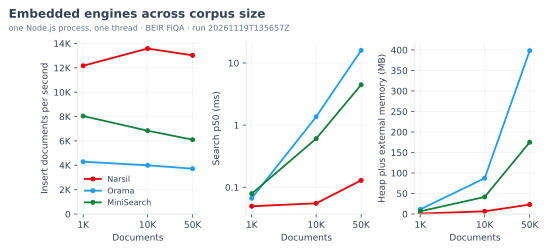

Insert throughput at each scale, documents per second:

| Engine | 1,000 | 10,000 | 50,000 |
| --- | ---: | ---: | ---: |
| Narsil | **12,172**\* | **13,584**\* | **13,026**\* |
| Orama | 4,290 | 4,001 | 3,720 |
| MiniSearch | 8,042 | 6,840 | 6,101 |

Search latency at each scale, p50 milliseconds:

| Engine | 1,000 | 10,000 | 50,000 |
| --- | ---: | ---: | ---: |
| Narsil | **0.049**\* | **0.055**\* | **0.129**\* |
| Orama | 0.066 | 1.361 | 15.969 |
| MiniSearch | 0.079 | 0.605 | 4.457 |

Heap plus external memory at each scale, megabytes:

| Engine | 1,000 | 10,000 | 50,000 |
| --- | ---: | ---: | ---: |
| Narsil | **1.1**\* | **6.6**\* | **23.1**\* |
| Orama | 11.4 | 87.3 | 398.2 |
| MiniSearch | 6.7 | 41.6 | 175.0 |

Filtered search latency at 50,000 documents, p50 milliseconds:

| Engine | Filtered search p50 ms |
| --- | ---: |
| Narsil | **0.150**\* |
| Orama | 8.024 |
| MiniSearch | not supported |
<!-- BENCH:inprocess-speed END -->

### Vector search

Narsil carries vector search in the same embedded engine. MiniSearch has no vector
support, so this tier compares Narsil against Orama.

<!-- BENCH:inprocess-vector START -->
Embedded vector search on BEIR SciFact:

| Engine | Recall@10 | Insert docs/s | Search p50 ms | Heap plus external MB |
| --- | ---: | ---: | ---: | ---: |
| Narsil | 100.0% | 50,499 | **1.057**\* | 34.1 |
| Orama | 100.0% | **189,085**\* | 3.735 | **10.5**\* |

Embedded vector search on BEIR NFCorpus:

| Engine | Recall@10 | Insert docs/s | Search p50 ms | Heap plus external MB |
| --- | ---: | ---: | ---: | ---: |
| Narsil | 100.0% | 44,863 | **0.807**\* | 32.4 |
| Orama | 100.0% | **191,692**\* | 2.584 | **7.2**\* |
<!-- BENCH:inprocess-vector END -->

## One engine in three languages: TypeScript, Rust, and Go

Narsil also ships as a Rust crate and as a Go module, and all three search through
the same C core. This suite runs each one in a separate process on the same machine,
with the same workload files and the same settings, so the differences between them
come from what each language adds around that core. A Python oracle that shares no
code with any engine checks every answer before the suite records a run.

<!-- BENCH:languages-setup START -->
- **Run.** These figures come from run `20261119T143653Z-142-22a057f1-a9b9-4415-b672-7555e19a8888`, recorded on 2026-11-19 from commit `3ad47df2c9c1`. The full tables, with peak memory, are in [the run report](benchmarks/engine-languages/results/runs/20261119T143653Z-142-22a057f1-a9b9-4415-b672-7555e19a8888/report.md).
- **Machine.** GCP c3-standard-8, us-east1-b hosted this run, and it reports Intel(R) Xeon(R) Platinum 8481C CPU @ 2.70GHz with 8 logical CPUs, 31 GiB of memory, and Linux 7.0.0-1017-gcp x64. Its C compiler is cc (Ubuntu 13.3.0-6ubuntu2~24.04.1) 13.3.0.
- **Keyword workload.** Keyword search covers 50,000 documents from BEIR FiQA with 1,000 queries drawn from the document text.
- **Vector workload.** Vector and hybrid search cover 5,183 documents from BEIR SciFact with 300 queries, each carrying a 384-dimension `Xenova/all-MiniLM-L6-v2` vector.
- **Settings.** Every engine returns 10 hits, stores every vector as float32 with no quantization, scores them with the cosine metric, builds its HNSW graph with `m` 16 and `efConstruction` 200, searches it with `efSearch` 50, and fuses hybrid results by reciprocal rank with `k` 60.
- **Threads.** The suite measures 1 and 8 concurrent callers with the same worker budget. One caller disables worker copies. TypeScript divides its budget between keyword and vector workers, Go configures a query pool, and Rust searches on the caller threads.
- **Repetitions.** Rates and memory figures are medians across 3 repetitions. Latency percentiles pool every measured query. The engine order rotates between repetitions. Each repetition makes 50 warm-up passes over the queries, then 500 measured keyword passes, 1,000 vector passes, and 1,000 hybrid passes.

| Language | Package | Version | Runtime | Build |
| --- | --- | --- | --- | --- |
| TypeScript | [`@delali/narsil`](https://www.npmjs.com/package/@delali/narsil/v/0.4.5) | 0.4.5 | Node.js v24.22.3 | C core narsil-core.node sha256 0f415364ce52699c162d26e9c6c16314aabdd63f39668dca35252f6dc4874c97 |
| Rust | [`delali-narsil`](https://crates.io/crates/delali-narsil/0.2.2) | 0.2.2 | rustc 1.99.1 (58cf8f9c3 2026-10-13) | cargo build --release |
| Go | [`github.com/assetcorp/narsil/packages/go/engine`](https://pkg.go.dev/github.com/assetcorp/narsil/packages/go/engine@v0.2.3) | 0.2.3 | go version go1.26.11 linux/amd64 | go build -trimpath |
<!-- BENCH:languages-setup END -->

### Query speed

<!-- BENCH:languages-speed START -->
Embedded TypeScript sends every search through the one JavaScript main thread, which caps its throughput when several callers query at once, while the HTTP server answers requests on separate request threads.

On 8 threads TypeScript answers through worker copies. Its 8 callers share the one Node.js main thread, which copies a query into a message to a free worker thread and copies the answer back out of its reply, and which answers on its own copy only while every worker is busy. Rust answers on each caller's thread, and Go hands each query to a free goroutine of its query pool over a channel, so both search the one index in shared memory and copy neither the query nor the answer. On 1 thread a TypeScript keyword query takes 58.9 µs at the median. On 8 threads each query also waits for those two copies and for its turn on the shared main thread, and TypeScript's keyword p50 reaches 368.8 µs while its queries per second go from 14,653 to 20,417. A worker copy runs the query itself off the main thread, so the application's own code on that thread keeps running while a search is under way.

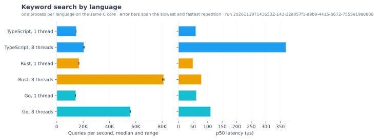

Keyword search, with queries per second as the median and the range across repetitions:

| Language | Threads | Queries per second | p50 µs | p99 µs |
| --- | ---: | ---: | ---: | ---: |
| TypeScript | 1 | 14,653 (14,619 to 14,724) | 58.9 | 206.2 |
| Rust | 1 | 16,775 (16,768 to 16,820) | 48.9 | 195.0 |
| Go | 1 | 14,256 (14,243 to 14,267) | 60.7 | 212.8 |
| TypeScript | 8 | 20,417 (20,063 to 20,861) | 368.8 | 974.8 |
| Rust | 8 | 81,025 (80,229 to 81,510) | 78.1 | 344.4 |
| Go | 8 | 55,825 (55,734 to 56,108) | 109.8 | 797.4 |

Vector search, with queries per second as the median and the range across repetitions:

| Language | Threads | Queries per second | p50 µs | p99 µs |
| --- | ---: | ---: | ---: | ---: |
| TypeScript | 1 | 9,050 (8,974 to 9,074) | 107.8 | 192.4 |
| Rust | 1 | 9,224 (8,590 to 9,509) | 98.4 | 128.7 |
| Go | 1 | 9,625 (9,587 to 9,711) | 101.2 | 148.6 |
| TypeScript | 8 | 10,968 (10,932 to 11,393) | 595.5 | 3,935.4 |
| Rust | 8 | 48,185 (48,174 to 48,584) | 147.6 | 188.3 |
| Go | 8 | 39,729 (39,510 to 40,058) | 163.6 | 1,204.5 |

Hybrid search, with queries per second as the median and the range across repetitions:

| Language | Threads | Queries per second | p50 µs | p99 µs |
| --- | ---: | ---: | ---: | ---: |
| TypeScript | 1 | 5,044 (4,891 to 5,094) | 193.3 | 319.5 |
| Rust | 1 | 5,329 (5,121 to 5,345) | 174.9 | 286.8 |
| Go | 1 | 6,233 (6,045 to 6,259) | 148.9 | 300.6 |
| TypeScript | 8 | 6,197 (6,164 to 6,247) | 1,209.9 | 4,218.9 |
| Rust | 8 | 28,366 (28,262 to 28,376) | 257.2 | 454.9 |
| Go | 8 | 23,245 (23,145 to 23,377) | 282.1 | 1,945.8 |
<!-- BENCH:languages-speed END -->

### Loading and memory

<!-- BENCH:languages-load START -->
Loading speed and the resident memory of the process once it holds the whole corpus:

| Language | Threads | Keyword docs/s | Keyword MiB | Vector docs/s | Vector MiB |
| --- | ---: | ---: | ---: | ---: | ---: |
| TypeScript | 1 | 19,115 (18,751 to 19,187) | 563.0 | 3,126 (3,108 to 3,127) | 405.4 |
| Rust | 1 | 24,418 (24,059 to 24,432) | 217.0 | 8,642 (8,512 to 8,667) | 127.7 |
| Go | 1 | 15,359 (15,262 to 15,393) | 189.2 | 4,113 (4,079 to 4,152) | 91.8 |
| TypeScript | 8 | 25,194 (25,005 to 25,345) | 986.7 | 4,955 (4,929 to 4,963) | 711.8 |
| Rust | 8 | 23,880 (23,845 to 23,985) | 234.3 | 8,436 (8,367 to 8,484) | 159.5 |
| Go | 8 | 15,794 (15,740 to 15,835) | 197.6 | 4,094 (4,064 to 4,323) | 112.1 |
<!-- BENCH:languages-load END -->

### Answers checked against the oracle

<!-- BENCH:languages-quality START -->
| Language | Threads | Recall@10 | Recall@100 | Hybrid recall@10 | Largest score error |
| --- | ---: | ---: | ---: | ---: | ---: |
| TypeScript | 1 | 0.9853 | 0.9720 | 0.9946 | 2.0e-07 |
| Rust | 1 | 0.9861 | 0.9718 | 0.9950 | 2.0e-07 |
| Go | 1 | 0.9863 | 0.9714 | 0.9947 | 2.0e-07 |
| TypeScript | 8 | 0.9887 | 0.9719 | 0.9966 | 2.0e-07 |
| Rust | 8 | 0.9870 | 0.9722 | 0.9953 | 2.0e-07 |
| Go | 8 | 0.9892 | 0.9715 | 0.9971 | 2.0e-07 |

The widest gap between two engines is 0.0022 in mean recall@10, between Go and Rust, and the oracle allows up to 0.0052 for that pair.
<!-- BENCH:languages-quality END -->

## Reproduce these numbers

- **Search servers.** The only requirement is Docker. From `benchmarks/server/`,
  run `./run-all.sh`. The harness builds the Narsil server from this repository,
  embeds every corpus once into a shared cache, runs each engine one at a time
  under equal precision and again under its recommended production settings, and
  writes a fresh run directory under `benchmarks/server/results/runs/`. The
  [server benchmark README](benchmarks/server/README.md) covers the configuration
  and the large-dataset path.
- **Embedded libraries.** From the repository root, run `pnpm build`, then
  `pnpm --filter benchmarks bench`. The
  [in-process benchmark README](benchmarks/in-process/README.md) lists the tiers
  and the single-tier commands.
- **Three languages.** The suite needs Node.js 24, the pinned Rust toolchain, Go,
  Python, and a C compiler. From the repository root, run `pnpm install`, then
  `pnpm nx run-many -t build --projects=narsil-ts,narsil-embeddings-transformers,@delali/narsil-native-build`,
  then `pnpm --filter engine-languages-benchmark bench`. The
  [language benchmark README](benchmarks/engine-languages/README.md) lists the
  versions that it needs.
- **This page.** After a run, `python3 benchmarks/writeup/charts.py` draws every
  figure into the run's own `charts/` directory, and
  `python3 benchmarks/writeup/generate.py` rewrites the tables above from the
  latest recorded run of each suite. `python3 benchmarks/writeup/generate.py
  --check` verifies that the page and its figures match those runs, and
  continuous integration runs the same check.

Absolute numbers move with the hardware, so the value is in the comparison between
engines measured on the same machine in the same run.
