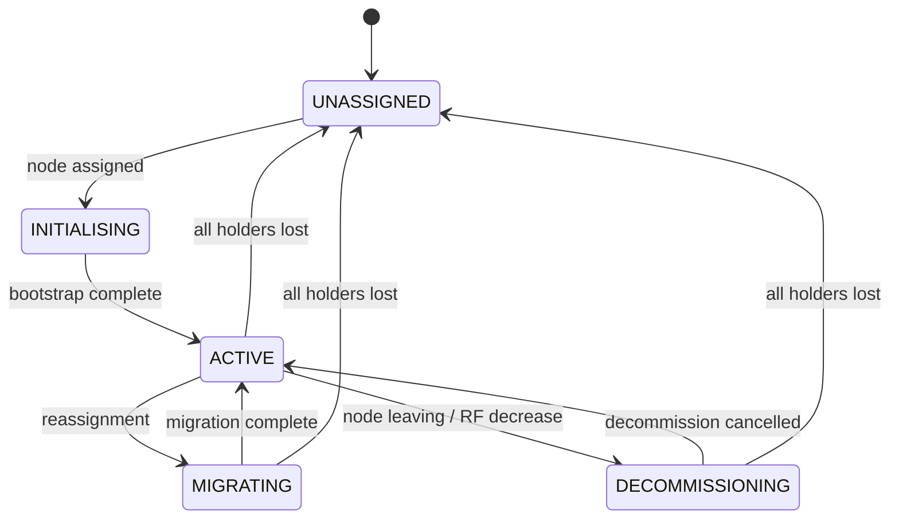

# Narsil Cluster Specification

This document defines cluster formation, node registration, roles,
the partition allocation table, and the partition state machine.
It also specifies the `ClusterCoordinator` adapter contract.

---

## ClusterCoordinator Adapter

The `ClusterCoordinator` adapter abstracts the coordination
backend (etcd, ZooKeeper, Consul, Kubernetes, or any strongly
consistent key-value store with watch support). All methods are
asynchronous.

### ClusterCoordinator Definition

```text
ClusterCoordinator {
  [async] fn registerNode(registration: NodeRegistration) -> none
  [async] fn deregisterNode(nodeId: string) -> none
  [async] fn listNodes() -> array[NodeRegistration]
  [async] fn watchNodes(handler: fn(event: NodeEvent) -> none) -> fn() -> none

  [async] fn getAllocation(indexName: string) -> AllocationTable or null
  [async] fn putAllocation(indexName: string, table: AllocationTable) -> none
  [async] fn watchAllocation(handler: fn(event: AllocationEvent) -> none) -> fn() -> none

  [async] fn getPartitionState(indexName: string, partitionId: uint32) -> PartitionState
  [async] fn putPartitionState(indexName: string, partitionId: uint32, state: PartitionState) -> none

  [async] fn acquireLease(key: string, nodeId: string, ttlMs: uint32) -> bool
  [async] fn renewLease(key: string, nodeId: string, ttlMs: uint32) -> bool
  [async] fn releaseLease(key: string) -> none

  [async] fn compareAndSet(key: string, expected: bytes or null, value: bytes) -> bool

  [async] fn getSchema(indexName: string) -> SchemaDefinition or null
  [async] fn putSchema(indexName: string, schema: SchemaDefinition) -> none
  [async] fn watchSchemas(handler: fn(event: SchemaEvent) -> none) -> fn() -> none

  [async] fn getLeaseHolder(key: string) -> string or null
  [async] fn shutdown() -> none
}
```

### Method Contracts

#### registerNode(registration)

- Registers the node in the cluster's node registry.
- The registration must include a lease-based heartbeat. If the
  node fails to renew its lease within the TTL, the coordinator
  removes the registration and emits a `node_left` event.
- Calling `registerNode` with an existing `nodeId` updates the
  registration (re-registration after restart).

#### deregisterNode(nodeId)

- Removes the node from the registry and releases its lease.
- Triggers a `node_left` event for watchers.
- Idempotent: deregistering a non-existent node is not an error.

#### listNodes()

- Returns all currently registered nodes.

#### watchNodes(handler)

- Registers a callback that fires when nodes join or leave.
- Events: `node_joined` (new registration), `node_left` (lease
  expired or explicit deregister).

#### getAllocation(indexName) / putAllocation(indexName, table)

- Reads or writes the allocation table for an index.
- `putAllocation` must be atomic: the entire table is written as
  a single unit or not at all.

#### watchAllocation(handler)

- Fires when any allocation table changes. The event includes the
  index name and the new table.

#### acquireLease(key, nodeId, ttlMs) / renewLease / releaseLease

- Lease-based distributed locking for controller election and
  per-partition primary assignment.
- `acquireLease` returns `true` if the lease was acquired,
  `false` if another node holds it.
- `renewLease` extends the TTL. Returns `false` if the lease was
  lost (expired or taken by another node).
- `releaseLease` explicitly releases the lease.

#### compareAndSet(key, expected, value)

- Atomic compare-and-set operation.
- If the current value at `key` equals `expected`, set it to
  `value` and return `true`. Otherwise return `false`.
- When `expected` is `null`, the operation succeeds only if the
  key does not exist.

#### getSchema / putSchema / watchSchemas

- Schema metadata is stored in the coordinator, not in the
  replication log (see [replication.md](replication.md)).
- `watchSchemas` fires when an index's schema is created or
  dropped. Nodes use this to discover new indexes and remove
  dropped ones.

#### getLeaseHolder(key)

- Returns the `nodeId` of the node currently holding the lease
  at `key`, or `null` if no node holds it.
- Used by primaries to discover the active controller when
  sending in-sync set removal requests.
- The returned value reflects the coordinator's current state;
  it may become stale if the lease expires between the read and
  subsequent use.

#### shutdown()

- Deregisters the node, releases all leases, stops all watchers.
- Must be idempotent.

---

## Event Types

Events fired by the `ClusterCoordinator` through watch callbacks.

### NodeEvent

```text
NodeEvent {
  type:         'node_joined' or 'node_left'
  nodeId:       string
  registration: NodeRegistration or null  (present for node_joined)
}
```

- `node_joined`: A new node registered or an existing node
  re-registered after restart.
- `node_left`: A node's lease expired or it explicitly
  deregistered. `registration` is `null` for leave events.

### AllocationEvent

```text
AllocationEvent {
  indexName: string
  table:     AllocationTable
}
```

Fires when any field of the allocation table for an index changes
(partition assignments, in-sync sets, state transitions, primary
term changes).

### SchemaEvent

```text
SchemaEvent {
  type:      'schema_created' or 'schema_dropped'
  indexName: string
  schema:    SchemaDefinition or null  (present for schema_created)
}
```

- `schema_created`: A new index was created in the cluster.
- `schema_dropped`: An index was dropped from the cluster.

---

## Node Registration

Every node in the cluster maintains a registration record. The
record format is defined by the spec so that nodes from different
language implementations can coexist in the same cluster.

### NodeRegistration

```text
NodeRegistration {
  nodeId:    string     (unique identifier, e.g. UUID v7)
  address:   string     (host:port for NodeTransport connections)
  roles:     array[string]  ('data', 'coordinator', 'controller')
  capacity: {
    memoryBytes:  uint64
    cpuCores:     uint16
    diskBytes:    uint64 or null
  }
  startedAt: string     (ISO 8601 timestamp)
  version:   string     (spec version, e.g. '1.0')
}
```

### NodeRegistration Fields

#### nodeId

A unique identifier for the node. Generated at startup using
UUID v7 (time-ordered). The `nodeId` is ephemeral; it changes on
every restart. This prevents stale registrations from persisting
after a crash.

#### address

The network address where this node's `NodeTransport` accepts
connections. Other nodes use this address to send replication
entries and query requests.

#### roles

The set of roles this node is configured to play. See
[Node Roles](#node-roles) below. A node must have at least one
role.

#### capacity

The node's available resources, reported at registration time.
The controller uses these values when computing partition
assignments. `diskBytes` is optional because some deployments
(browser, in-memory) have no disk.

#### startedAt

ISO 8601 timestamp of when the node started. Used for
diagnostics and to break ties during controller election
(prefer the node that has been running longest).

#### version

The spec version this node follows. Nodes with
incompatible spec versions must not join the same cluster. The
controller rejects registrations where the major version differs
from its own.

---

## Node Roles

A node plays one or more of three roles. By default, a node plays
all three.

### data

A data node holds partitions, executes local indexing and search,
and participates in replication (as primary or replica). Data
nodes run the full Narsil engine locally: `PartitionManager`,
`WorkerPool`, `fanOutQuery()`, and all search/indexing logic.

A data node is stateful. Adding or removing data nodes triggers
partition reallocation.

### coordinator

A coordinator node receives client queries, reads the allocation
table to determine which data nodes hold the relevant partitions,
fans out the query via `NodeTransport`, and merges results. It
does not hold any partitions itself.

A coordinator node is stateless. It caches the allocation table
locally (updated via `watchAllocation`) and can be added or
removed without any data movement.

When a data node receives a client query, it acts as coordinator
for that request in addition to querying its own local partitions.
This means every data node implicitly performs the coordinator
role for queries it receives directly.

### controller

A controller node runs the partition allocator, watches cluster
membership changes, and writes updated allocation tables to the
`ClusterCoordinator`. Only one controller is active at any time;
the rest are standbys. Controller election uses the
`acquireLease` mechanism.

Run an odd number of controller-capable nodes (recommended: 3)
to ensure a lease holder is always available after a single node
failure.

The controller does not handle data or queries. Its resource
requirements are minimal.

### Default Configuration

When no explicit role configuration is provided, a node plays all
three roles. This is the recommended configuration for clusters of
3 nodes or fewer.

At larger cluster sizes, separating roles reduces resource
contention. The controller's lease renewal and allocator
computation compete with query execution on mixed-role nodes.
Similarly, the coordinator's result merging and sorting compete
with indexing workload on data nodes.

Guidance for role separation by cluster size:

| Cluster Size | Recommended Topology |
| ------------- | -------------------- |
| 1-3 nodes | All roles on every node |
| 3-10 data nodes | Dedicate 3 nodes as controller-only |
| 10+ data nodes | Add stateless coordinator nodes behind a load balancer |

---

## Allocation Table

The allocation table maps every partition of an index to its
primary node and replica nodes. The controller writes this table
to the `ClusterCoordinator` whenever the cluster topology changes
(node joins, node leaves, index created, partition split).

### AllocationTable

```text
AllocationTable {
  indexName:         string
  version:           uint64  (monotonically increasing, incremented on every update)
  replicationFactor: uint8   (number of replicas per partition, not counting the primary)
  assignments:       map[uint32, PartitionAssignment]
}

PartitionAssignment {
  primary:    string or null   (nodeId of the primary)
  replicas:   array[string]    (nodeIds of replica nodes)
  inSyncSet:  array[string]    (nodeIds of replicas fully caught up with the primary)
  state:      PartitionState
  primaryTerm: uint64          (current primary term, incremented on failover)
}
```

### AllocationTable Fields

#### version

A monotonically increasing counter. Every update to the
allocation table increments this value. Nodes compare their
cached version against the coordinator's version to detect stale
state. Operations tagged with a lower allocation version than the
node's current version are rejected.

#### replicationFactor

The number of replicas per partition (not counting the primary).
A replication factor of 2 means each partition has 1 primary and
2 replicas, for 3 total copies. The default is 1 (1 primary + 1
replica = 2 copies).

Configurable per index at creation time. Changing the replication
factor on an existing index triggers reallocation.

#### assignments

A map from partition ID to its assignment. Every partition in the
index must have an entry. Partitions without a live primary have
`primary: null` and are in the `UNASSIGNED` state.

---

## Partition State Machine

Each partition transitions through a defined set of states during
its lifecycle. The controller manages state transitions and writes
them to the `ClusterCoordinator`.

### PartitionState Enum

```text
PartitionState = 'UNASSIGNED'
               | 'INITIALISING'
               | 'ACTIVE'
               | 'MIGRATING'
               | 'DECOMMISSIONING'
```

### State Transitions



| State | Description |
|---|---|
| `UNASSIGNED` | No node holds this partition. Occurs when an index is first created or when the primary and all replicas are lost. |
| `INITIALISING` | A node is bootstrapping this partition, either via incremental catch-up or full snapshot transfer. The partition does not serve reads or accept writes in this state. |
| `ACTIVE` | The partition is fully operational. The primary accepts writes and serves reads. Replicas serve reads and receive replication entries. |
| `MIGRATING` | The partition's primary or replica assignment is changing. The old holder continues serving while the new holder bootstraps. Once the new holder reaches `ACTIVE`, the migration completes. |
| `DECOMMISSIONING` | The partition is being removed from a node (the node is leaving the cluster or the replication factor is decreasing). Reads continue until the transition completes. |

### State Transition Rules

- Only the controller may transition a partition between states.
- A partition in `INITIALISING` transitions to `ACTIVE` when the
  assigned node reports that bootstrapping is complete.
- A partition transitions to `MIGRATING` when the controller
  reassigns it (due to rebalancing or node failure).
- A partition transitions to `DECOMMISSIONING` when it is no
  longer needed on a specific node (replication factor decrease or
  node decommission).
- If all nodes holding a partition fail, it returns to
  `UNASSIGNED`.

---

## Controller Election

Exactly one controller node is active at any time. Election uses
the `acquireLease` mechanism on a well-known key
(`_narsil/controller`).

### Election Protocol

```text
1. On startup, a controller-capable node calls:
   acquireLease('_narsil/controller', nodeId, ttlMs)

2. If the lease is acquired:
   - The node becomes the active controller.
   - It starts watching membership and allocation events.
   - It renews the lease on a periodic interval
     (recommended: ttlMs / 3).

3. If the lease is not acquired:
   - The node becomes a standby controller.
   - It periodically retries acquireLease.

4. If a lease renewal fails (the node was partitioned or slow):
   - The node must immediately cease controller operations.
   - It returns to standby and retries acquireLease.
```

### Controller Responsibilities

The active controller:

1. Watches for node join/leave events via `watchNodes`.
2. When the topology changes, runs the partition allocator to
   compute a new allocation table.
3. Writes the new allocation table to the coordinator via
   `putAllocation`.
4. Manages partition state transitions.
5. Handles per-partition primary election: when a primary dies,
   the controller selects a replica from the in-sync set and
   promotes it (see [replication.md](replication.md#failover)).

---

## Partition Allocator

The allocator is a pure function that computes the allocation
table from the current cluster state. It runs on the controller
whenever the topology changes.

### Allocator Contract

```text
fn allocate(
  nodes:             array[NodeRegistration]
  currentTable:      AllocationTable or null
  indexName:         string
  partitionCount:    uint32
  replicationFactor: uint8
  constraints:       AllocationConstraints
) -> AllocationTable
```

When `currentTable` is `null` (new index), the allocator uses
`partitionCount` to create assignments for partitions 0 through
`partitionCount - 1`. When `currentTable` is present (topology
change), the allocator uses the existing partition set and
rebalances assignments across the updated node list.

The allocator must satisfy these constraints:

- **No co-location:** A partition's primary and its replicas must
  be on different nodes.
- **Capacity-aware:** Do not assign more partitions to a node
  than its reported memory can hold.
- **Balanced:** Distribute partitions as evenly as possible across
  nodes, weighted by node capacity.
- **Minimal movement:** When recomputing after a topology change,
  minimise the number of partitions that move. Stability is
  preferred over perfect balance.
- **Zone-aware (optional):** When nodes report zone or rack
  metadata in their capacity, spread replicas across zones.

### AllocationConstraints

```text
AllocationConstraints {
  zoneAwareness: bool   (default: false)
  zoneAttribute: string (node capacity key for zone, default: 'zone')
  maxShardsPerNode: uint32 or null  (optional upper bound)
}
```

### Allocator Algorithm

The allocator algorithm is implementation-defined. The spec
defines the contract (inputs, outputs, constraints), not the
heuristic. Implementations may use:

- Rendezvous hashing (used by Meilisearch)
- Consistent hashing with bounded loads
- A greedy weight-based balancer (used by Elasticsearch)
- Constraint-solver-based placement

The chosen algorithm must satisfy the constraints above and
produce deterministic output for identical input.

---

## Node Lifecycle

### Joining the Cluster

```text
1. Node starts and creates a ClusterCoordinator connection.
2. Node calls registerNode() with its NodeRegistration.
3. Node reads the current allocation table via getAllocation().
4. For each partition assigned to this node:
   a. If the partition state is INITIALISING:
      - Begin bootstrap from the primary
        (see replication.md for the sync protocol).
   b. If the partition state is ACTIVE:
      - Load the partition from local persistence (if available)
        or bootstrap from the primary.
5. Node starts watching for allocation changes via
   watchAllocation().
6. Node begins accepting queries and mutations via NodeTransport.
```

### Leaving the Cluster (Graceful)

```text
1. Node signals intent to leave by calling deregisterNode().
2. The controller detects the node_left event.
3. The controller reassigns the node's partitions to other nodes:
   a. For primary partitions: promote a replica to primary
      (see replication.md for failover).
   b. For replica partitions: assign to another node.
4. The controller writes the updated allocation table.
5. Other nodes observe the change, begin bootstrapping any
   newly assigned partitions.
6. The leaving node shuts down after in-flight operations
   complete.
```

### Node Failure (Ungraceful)

```text
1. The node's lease expires in the ClusterCoordinator.
2. A node_left event fires.
3. The controller follows the same reassignment protocol as
   graceful leave, but without waiting for the failed node to
   complete in-flight operations.
4. Any partitions where the failed node was primary and no
   in-sync replicas exist transition to UNASSIGNED. These
   partitions are unavailable until a node with persisted data
   for them rejoins or the data is rebuilt from an external
   source.
```

---

## Cluster Coordinator Built-in Adapters

| Adapter | Backend | Use Case |
|---|---|---|
| EtcdCoordinator | etcd v3 | Production deployments. Uses etcd leases for node heartbeats, KV for allocation tables, and watches for change notification. |
| InMemoryCoordinator | In-process map | Testing and single-process development. No external infrastructure needed. |
| KubernetesCoordinator | Kubernetes API | Kubernetes-native deployments. Uses Lease objects for elections, ConfigMaps or CRDs for allocation tables, and the watch API for change notification. |

### Community Adapter Guidelines

Community adapters (Consul, ZooKeeper, FoundationDB, Redis, etc.)
must:

- Support atomic `compareAndSet` operations.
- Support lease-based TTL for node heartbeats.
- Support watch/subscribe for change notification.
- Serialise all stored data as MessagePack.
- Handle the full `ClusterCoordinator` interface.
