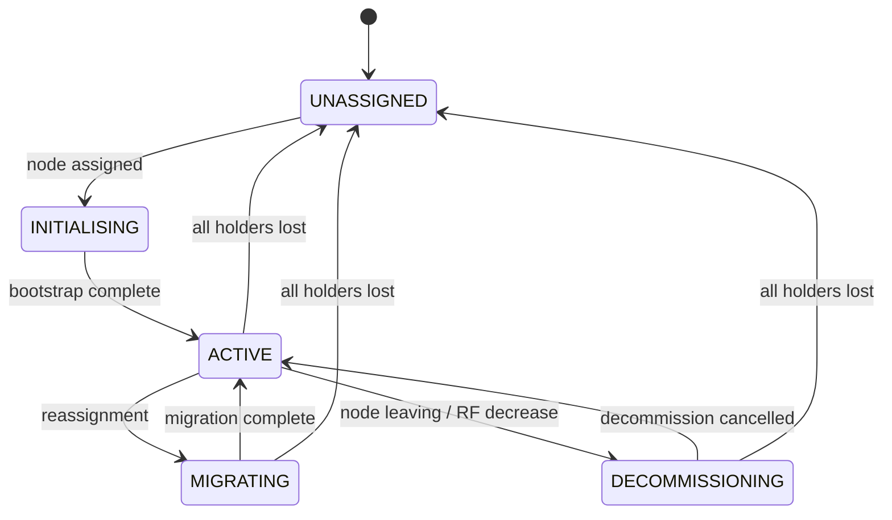

# Narsil Cluster Specification

This document defines cluster formation, node registration, node roles, the partition allocation table, and the partition state machine. It also defines the `ClusterCoordinator` adapter contract.

Structure definitions use a language-neutral notation. `List<T>` is an ordered collection of `T`, `Map<K, V>` a mapping from keys to values, and `T or absent` a value that may be missing; each implementation expresses these in its own type system.

---

## ClusterCoordinator Adapter

The `ClusterCoordinator` adapter covers the coordination backend, which can be etcd, ZooKeeper, Consul, Kubernetes, or any strongly consistent key-value store that supports watches. Every method is asynchronous.

```text
ClusterCoordinator {
  async registerNode(registration: NodeRegistration) -> nothing
  async deregisterNode(nodeId: string) -> nothing
  async listNodes() -> List<NodeRegistration>
  async watchNodes(handler: (event: NodeEvent) -> nothing) -> (() -> nothing)

  async getAllocation(indexName: string) -> AllocationTable or absent
  async putAllocation(indexName: string, table: AllocationTable, expectedVersion: uint64 or absent) -> boolean
  async deleteAllocation(indexName: string) -> nothing
  async watchAllocation(handler: (event: AllocationEvent) -> nothing) -> (() -> nothing)

  async getPartitionState(indexName: string, partitionId: uint32) -> PartitionState
  async putPartitionState(indexName: string, partitionId: uint32, state: PartitionState) -> nothing

  async acquireLease(key: string, nodeId: string, ttlMs: uint32) -> boolean
  async renewLease(key: string, nodeId: string, ttlMs: uint32) -> boolean
  async releaseLease(key: string) -> nothing

  async get(key: string) -> bytes or absent
  async compareAndSet(key: string, expected: bytes or absent, value: bytes) -> boolean

  async getSchema(indexName: string) -> SchemaDefinition or absent
  async putSchema(indexName: string, schema: SchemaDefinition) -> nothing
  async dropSchema(indexName: string) -> nothing
  async listSchemas() -> List<string>
  async watchSchemas(handler: (event: SchemaEvent) -> nothing) -> (() -> nothing)

  async getLeaseHolder(key: string) -> string or absent
  async shutdown() -> nothing
}
```

### registerNode(registration)

- Adds the node to the cluster's node registry.
- The registration must carry a lease-based heartbeat. A node that fails to renew its lease within the TTL loses its registration, and the coordinator emits a `node_left` event.
- Registering an existing `nodeId` again updates that registration, which is what a node does after a restart.

### deregisterNode(nodeId)

- Removes the node from the registry and releases its lease, which fires a `node_left` event for every watcher.
- It is idempotent, so deregistering a node that is not registered is not an error.

### listNodes()

- Returns every node currently registered.

### watchNodes(handler)

- Registers a callback that fires as nodes join and leave. A `node_joined` event follows a new registration, and a `node_left` event follows an expired lease or an explicit deregistration.

### getAllocation(indexName) and putAllocation(indexName, table, expectedVersion)

- These read and write the allocation table of one index.
- `putAllocation` must be atomic: the whole table is written or nothing is.
- `putAllocation` takes an optimistic concurrency check through `expectedVersion`. With a version supplied, the write succeeds only when the stored table carries that version. With `expectedVersion` absent, the write succeeds only when no table exists for the index yet. It returns true when the write succeeded and false when the check failed.
- That check is what stops a split brain: a controller that has lost its lease cannot overwrite a newer table written by its successor, because the version has already moved on.

### deleteAllocation(indexName)

- Removes the allocation table of one index, which is the last step of the [deletion flow](#index-deletion-flow).
- It is idempotent, so deleting a table that does not exist is not an error.

### watchAllocation(handler)

- Fires whenever any allocation table changes, carrying the index name and the new table.

### acquireLease, renewLease, and releaseLease

- These provide lease-based distributed locking for controller election and per-partition primary assignment.
- `acquireLease` returns true when the lease was taken and false when another node holds it.
- `renewLease` extends the TTL, and returns false when the lease is gone, whether it expired or another node took it.
- `releaseLease` gives the lease up.

### get(key)

- Returns the raw bytes stored under `key` in the coordinator's general key-value store, or absent when the key holds nothing.
- The controller uses it to read index metadata while handling a `schema_created` event; see [Index Metadata](#index-metadata).

### compareAndSet(key, expected, value)

- Sets `key` to `value` and returns true when the current value equals `expected`, and returns false otherwise.
- With `expected` absent, it succeeds only when the key does not exist.

### getSchema, putSchema, dropSchema, listSchemas, and watchSchemas

- Schema metadata is stored in the coordinator, not in the replication log; see [replication.md](replication.md).
- `dropSchema` removes the stored schema and fires a `schema_dropped` event, which starts the [deletion flow](#index-deletion-flow). It is idempotent.
- `listSchemas` returns the name of every stored schema, which is how a newly elected controller finds the indexes it must reconcile.
- `watchSchemas` fires when an index schema is created or dropped, which is how a node discovers a new index and learns that one has gone.

### getLeaseHolder(key)

- Returns the `nodeId` of the node holding the lease at `key`, or absent when no node holds it.
- A primary uses it to find the active controller before it asks to add a replica to the in-sync set or to remove one.
- The value reflects the coordinator's state at the moment of the read, and it can go stale when the lease expires between the read and the use.

### shutdown()

- Deregisters the node, releases every lease, and stops every watcher.
- It must be idempotent.

---

## Event Types

These events reach the watch callbacks.

### NodeEvent

```text
NodeEvent {
  type:         'node_joined' or 'node_left'
  nodeId:       string
  registration: NodeRegistration or absent   (present on node_joined)
}
```

A `node_joined` event follows a new registration, or a re-registration after a restart. A `node_left` event follows an expired lease or an explicit deregistration, and it carries no registration.

### AllocationEvent

```text
AllocationEvent {
  indexName: string
  table:     AllocationTable
}
```

It fires when any field of an index's allocation table changes, whether that is a partition assignment, an in-sync set, a state transition, or a primary term.

### SchemaEvent

```text
SchemaEvent {
  type:      'schema_created' or 'schema_dropped'
  indexName: string
  schema:    SchemaDefinition or absent   (present on schema_created)
}
```

---

## Node Registration

Every node keeps a registration record. The specification fixes its format so that nodes written in different languages can share one cluster.

```text
NodeRegistration {
  nodeId:    string          (unique identifier, such as a UUID v7)
  address:   string          (host and port where the node transport listens)
  roles:     List<string>    ('data', 'coordinator', 'controller')
  capacity: {
    memoryBytes: uint64
    cpuCores:    uint16
    diskBytes:   uint64 or absent
  }
  startedAt: string          (ISO 8601 timestamp)
  version:   string          (specification version, such as '1.0')
}
```

### nodeId

A unique identifier generated at startup, recommended as a time-ordered UUID v7. It is ephemeral and changes on every restart, which keeps a stale registration from outliving a crash.

### address

The network address where this node's transport accepts connections. Other nodes send replication entries and query requests there.

### roles

The roles this node is configured to play; see [Node Roles](#node-roles). A node must carry at least one.

### capacity

The resources the node reports at registration, which the controller reads when it computes assignments. `diskBytes` may be absent, because a browser or in-memory deployment has no disk.

### startedAt

The ISO 8601 timestamp of when the node started. It serves diagnostics, and it breaks a tie during controller election in favour of the node that has been running longest.

### version

The specification version the node follows. Nodes on incompatible versions must not share a cluster, and the controller rejects a registration whose major version differs from its own.

---

## Node Roles

A node plays one or more of three roles, and by default it plays all three.

### data

A data node holds partitions, runs indexing and search locally, and takes part in replication as primary or replica. It runs the full engine in-process: partition management, worker threads, fan-out, and every search and indexing path.

A data node is stateful, so adding or removing one triggers partition reallocation.

### coordinator

A coordinator node receives client queries, reads the allocation table to learn which data nodes hold the relevant partitions, fans the query out over the node transport, and merges the results. It holds no partitions of its own.

A coordinator node is stateless. It caches the allocation table locally, kept current by the allocation watch, so it can be added or removed with no data movement.

A data node that receives a client query acts as coordinator for that request as well as searching its own partitions, so every data node carries the coordinator role for the queries it receives directly.

### controller

A controller node runs the partition allocator, watches membership changes, and writes updated allocation tables to the cluster coordinator. Exactly one controller is active at a time and the rest stand by; election runs through the lease mechanism.

Run an odd number of controller-capable nodes, three by recommendation, so that a lease holder remains available after any single node fails.

A controller handles no data and no queries, and its resource needs are small.

### Default Configuration

With no explicit role configuration, a node plays all three roles, which is the recommendation for a cluster of three nodes or fewer.

Separating the roles pays off as a cluster grows. On a mixed-role node the controller's lease renewal and allocator run compete with query execution, and the coordinator's merging and sorting compete with indexing.

| Cluster size | Recommended topology |
|--------------|----------------------|
| 1 to 3 nodes | Every role on every node |
| 3 to 10 data nodes | Three nodes dedicated to the controller role |
| More than 10 data nodes | Stateless coordinator nodes added behind a load balancer |

---

## Allocation Table

The allocation table maps every partition of an index to its primary node and its replica nodes. The controller writes it to the cluster coordinator whenever the topology changes, whether a node joined, a node left, an index was created, or a partition split.

```text
AllocationTable {
  indexName:         string
  version:           uint64   (increases on every update)
  replicationFactor: uint8    (replicas per partition, the primary excluded)
  assignments:       Map<uint32, PartitionAssignment>
}

PartitionAssignment {
  primary:          string or absent   (nodeId of the primary)
  replicas:         List<string>       (nodeIds of the replica nodes)
  inSyncSet:        List<string>       (nodeIds of the replicas fully caught up, or the last holders in UNASSIGNED)
  state:            PartitionState
  primaryTerm:      uint64             (the current term, raised on failover)
  commitPoint:      uint64             (a floor on the seqNo acknowledged to a client)
  unassignedReason: UnassignedReason or absent
}
```

### version

A counter that increases on every update. A node compares its cached version with the coordinator's to spot stale state, and it rejects an operation tagged with a version below its own.

### replicationFactor

The number of replicas per partition, not counting the primary, so a factor of 2 gives one primary and two replicas, three copies in total. The default is 1, which is two copies.

It is set per index at creation time, and changing it on an existing index triggers reallocation.

### assignments

A map from partition ID to its assignment, with an entry for every partition in the index. A partition with no live primary has an absent `primary` and the state `UNASSIGNED`. When the controller moves a partition to `UNASSIGNED`, it writes the final primary and the replicas that were in sync with that primary into `inSyncSet`, because those nodes hold every write the cluster acknowledged for the partition. Those nodes are the partition's last holders. [No Eligible Replica](replication.md#no-eligible-replica) governs how the controller gives the partition back to one of them.

### unassignedReason

The controller writes this field whenever a partition stays `UNASSIGNED` after it asks the partition's last holders for a copy. It writes one of four values:

```text
UnassignedReason = 'HOLDER_OFFLINE'
                 | 'HOLDER_UNREACHABLE'
                 | 'HOLDER_IDENTITY_MISMATCH'
                 | 'HOLDER_WITHOUT_DATA'
```

| Reason | Meaning |
|--------|---------|
| `HOLDER_OFFLINE` | A node `inSyncSet` names is absent from the coordinator's registrations, so the controller waits for it to return. |
| `HOLDER_UNREACHABLE` | A registered holder left [cluster.partition_stores](transport.md#clusterpartition_stores) unanswered, or it answered with a payload the controller could not read. |
| `HOLDER_IDENTITY_MISMATCH` | A holder answered under an `indexUuid` that differs from the one the coordinator holds, so that copy holds the documents of an earlier index of the same name. |
| `HOLDER_WITHOUT_DATA` | Every holder answered under the coordinator's `indexUuid` with a list that left the partition out. |

The controller writes the first value that applies in the order above, so a partition that may still come back never reports a reason that rules recovery out. It repeats the enquiry whenever a node registers. It sets no limit on the number of attempts, because a holder may return at any time. It removes the field when it moves the partition out of `UNASSIGNED`. A partition that reaches `UNASSIGNED` at index creation leaves the field absent, because the controller asks no node about a partition that never held a document.

---

## Partition State Machine

Every partition moves through a fixed set of states. The controller owns those transitions and writes each one to the cluster coordinator.

```text
PartitionState = 'UNASSIGNED'
               | 'INITIALISING'
               | 'ACTIVE'
               | 'MIGRATING'
               | 'DECOMMISSIONING'
```


```mermaid
stateDiagram-v2
    [*] --> UNASSIGNED
    UNASSIGNED --> INITIALISING : node assigned
    INITIALISING --> ACTIVE : bootstrap complete
    ACTIVE --> MIGRATING : reassignment
    MIGRATING --> ACTIVE : migration complete
    ACTIVE --> DECOMMISSIONING : node leaving / RF decrease
    DECOMMISSIONING --> ACTIVE : decommission cancelled
    MIGRATING --> UNASSIGNED : all holders lost
    ACTIVE --> UNASSIGNED : all holders lost
    DECOMMISSIONING --> UNASSIGNED : all holders lost
```

| State | Meaning |
|-------|---------|
| `UNASSIGNED` | No node holds this partition, which happens when an index is first created and when the primary and every replica are lost. |
| `INITIALISING` | A node is bootstrapping the partition, by incremental catch-up or by snapshot transfer. It serves no reads and accepts no writes while it does. |
| `ACTIVE` | The partition is fully operational. The primary accepts writes and serves reads, and each replica serves reads and receives replication entries. |
| `MIGRATING` | The primary or replica assignment is changing. The old holder keeps serving while the new one bootstraps, and the migration finishes once the new holder reaches `ACTIVE`. |
| `DECOMMISSIONING` | The partition is being removed from a node, because that node is leaving or the replication factor dropped. Reads continue until the transition finishes. |

Four rules govern the transitions:

- Only the controller may move a partition between states.
- A partition in `INITIALISING` moves to `ACTIVE` when the assigned node reports that bootstrapping finished.
- A partition moves to `MIGRATING` when the controller reassigns it, whether for rebalancing or after a node failure.
- A partition moves to `DECOMMISSIONING` when a node no longer needs to hold it, because the replication factor dropped or the node is being decommissioned.

A partition whose holders have all failed returns to `UNASSIGNED`.

---

## Controller Election

Exactly one controller is active at a time, elected by acquiring a lease on the well-known key `_narsil/controller`.

```text
1. On startup, a controller-capable node calls
   acquireLease('_narsil/controller', nodeId, ttlMs).

2. When it takes the lease:
     it becomes the active controller
     it starts watching membership and allocation events
     it renews the lease periodically, recommended at ttlMs / 3

3. When it does not take the lease:
     it becomes a standby controller
     it retries acquireLease periodically

4. When a renewal fails, because the node was cut off or ran slow:
     it must stop every controller operation at once
     it returns to standby and retries acquireLease
```

The active controller does five things: it watches node join and leave events, runs the partition allocator whenever the topology changes, writes the new allocation table through `putAllocation`, drives partition state transitions, and elects a new primary per partition when one dies by promoting a replica from the in-sync set. The promotion rules are in [Failover](replication.md#failover).

---

## Partition Allocator

The allocator computes an allocation table from the current cluster state, and it runs on the controller whenever the topology changes. It is a pure function of its inputs.

```text
allocate(
  nodes:             List<NodeRegistration>
  currentTable:      AllocationTable or absent
  indexName:         string
  partitionCount:    uint32
  replicationFactor: uint8
  constraints:       AllocationConstraints
) -> AllocationTable
```

With `currentTable` absent, meaning a new index, the allocator uses `partitionCount` to create assignments for partitions 0 through `partitionCount - 1`. With a table present, meaning a topology change, it keeps the existing partition set and rebalances the assignments across the updated node list.

The allocator must satisfy five constraints:

- **No co-location.** A partition's primary and its replicas are on different nodes.
- **Capacity awareness.** No node receives more partitions than its reported memory can hold.
- **Balance.** Partitions spread as evenly as node capacity allows.
- **Minimal movement.** A recomputation after a topology change moves as few partitions as it can, because stability beats perfect balance.
- **Zone awareness**, optional. When nodes report zone or rack metadata, replicas spread across zones.

```text
AllocationConstraints {
  zoneAwareness:    boolean          (default false)
  zoneAttribute:    string           (the capacity key naming the zone, default 'zone')
  maxShardsPerNode: uint32 or absent (an optional upper bound)
}
```

The heuristic itself is implementation-defined. This specification fixes the inputs, the outputs, and the constraints, and leaves the choice open between rendezvous hashing, consistent hashing with bounded loads, a greedy weight-based balancer, and constraint-solver placement. Whichever an implementation picks must satisfy the constraints above and produce identical output for identical input.

---

## Index Metadata

Creating an index in cluster mode stores index-level configuration in the coordinator, so that the controller can read it when it computes the first allocation.

```text
IndexMetadata {
  indexUuid:         string   (unique identifier, such as a UUID v7)
  partitionCount:    uint32
  replicationFactor: uint8
  constraints:       AllocationConstraints
}
```

The `indexUuid` identifies the index for as long as it exists, and the creating node generates it. An index created again under a dropped name carries a new `indexUuid`, so the two indexes stay distinct where their names do not. A node must compare the value with the one it persisted before it adopts a local copy; see [Joining the Cluster](#joining-the-cluster).

The record is serialised as MessagePack and stored in the coordinator's general key-value store under a well-known key:

```text
_narsil/index/{indexName}/config
```

### Index Creation Flow

```text
1. The node receiving the create request:
   a. generates a fresh indexUuid
   b. writes the index metadata with
      compareAndSet('_narsil/index/{indexName}/config', absent, bytes),
      where the absent check blocks a duplicate creation
   c. writes the schema with putSchema(indexName, schema), which
      fires a schema_created event

2. The controller observes that event:
   a. it reads the metadata with
      get('_narsil/index/{indexName}/config')
   b. it runs the allocator with the partitionCount,
      replicationFactor, and constraints it found
   c. it writes the first allocation table with putAllocation

3. A creating node that crashes between steps 1b and 1c leaves
   metadata behind with no schema event, so the controller does
   nothing and the metadata is orphaned. The next create call for
   the same name fails its compareAndSet, because the key already
   exists, which tells the caller a partial creation happened so
   that it can retry or clean up.

4. A controller that crashes between steps 2a and 2c leaves a
   schema with no allocation. The next controller finds the schema
   through listSchemas and no table through getAllocation, and runs
   the allocator to finish the job.
```

The `partitionCount` is fixed once the index exists. Changing it means creating a new index and reindexing into it. Every node must create its local index with exactly `partitionCount` partitions, so that a serialised partition loads unchanged on any holder.

The `replicationFactor` can change after creation by updating the allocation table, and the controller applies the new factor on the next rebalance.

### Index Deletion Flow

Deleting an index reverses the creation flow, and the controller drives the teardown so that every holder learns of it through the allocation watch it already runs.

```text
1. The node receiving the drop request:
   a. clears the index metadata with
      compareAndSet('_narsil/index/{indexName}/config', current, empty)
   b. drops the schema with dropSchema(indexName), which fires a
      schema_dropped event

2. The controller observes that event:
   a. it writes an allocation table with no assignments through
      putAllocation, using the stored table's version as the
      expected version
   b. it deletes the table with deleteAllocation

3. Every node holding a partition observes the empty table, drops
   the partitions it held, and drops its local index once it holds
   no partition of that index.

4. A controller that crashes between steps 2a and 2b leaves an
   empty table behind. Every reader must treat an allocation table
   with no assignments as absent, so the next create call for the
   same name allocates afresh and the empty table is overwritten.

5. An empty metadata value under the index config key counts as
   absent, so the next create call for the same name may replace
   it with fresh metadata. A non-empty value still blocks the
   create, exactly as the creation flow describes.

6. A node that stays offline for the whole teardown keeps its
   local copy, because it observes no allocation change while it
   is gone. It finds that copy orphaned when it rejoins; see
   [Joining the Cluster](#joining-the-cluster).
```

A drop is not atomic across nodes: a query routed while the teardown runs can reach a node that already dropped its partitions, and the coordinator then reports the failure through the partial-results rules in [query-routing.md](query-routing.md#partial-results).

---

## Node Lifecycle

### Joining the Cluster

```text
1. The node starts and opens a cluster coordinator connection.
2. The node calls registerNode with its registration.
3. For each index it holds locally, the node reads the stored
   metadata with get('_narsil/index/{indexName}/config') and
   compares the stored indexUuid with the one it persisted:
   a. equal values mean the local copy belongs to this index, and
      the node adopts it
   b. differing values mean the cluster created another index
      under the name this copy carries, so the node drops the
      copy and takes the new index on from its primary
   c. a local copy that carries no identity takes the stored one,
      which is how an index created before the field existed
      joins, and the node adopts it
   d. metadata the node cannot read, and a name the coordinator
      holds none for, leave the copy orphaned, and the rules
      below govern it
4. The node reads the current allocation table with getAllocation.
5. For each partition assigned to it:
   a. a partition in INITIALISING starts bootstrapping from the
      primary, following the sync protocol in replication.md
   b. a partition in ACTIVE loads from an adopted local copy when
      that exists, and otherwise bootstraps from the primary
6. The node starts watching allocation changes with watchAllocation.
7. The node starts accepting queries and mutations over the node
   transport.
```

A node must persist the `indexUuid` alongside its local copy, in the `index_uuid` field of the [index metadata payload](../envelope.md#index-metadata-payload), so that the comparison survives a restart. A node must also record the identity on every index it bootstraps, whether it took the partition on as primary or as replica, because an index that carries none proves nothing at the next join.

Step 3b is the only step that deletes local data, and the stored metadata is what permits it: metadata naming another index under the same name proves that the index this copy belongs to was dropped, so the copy holds documents no reader may see again.

Three rules govern an orphaned copy:

- The node must neither serve it nor adopt it into an index of the same name, because an index created again under a dropped name holds different documents.
- The node must report it, naming the index and the reason the adoption failed, so that an operator can act on it.
- The node must keep the data. Absent metadata follows equally from a dropped index, an unreachable coordinator, and a coordinator restored from a backup, and in the last two cases the local copy is the only one left.

An operator deletes an orphaned copy explicitly, and every automatic path leaves it alone.

### Leaving the Cluster Gracefully

```text
1. The node announces its departure by calling deregisterNode.
2. The controller sees the node_left event.
3. The controller reassigns that node's partitions:
   a. a partition it held as primary gets a replica promoted, as
      described in replication.md
   b. a partition it held as replica goes to another node
4. The controller writes the updated allocation table.
5. The other nodes observe the change and bootstrap whatever they
   have newly been assigned.
6. The leaving node shuts down once its in-flight operations finish.
```

### Node Failure

```text
1. The node's lease expires in the cluster coordinator.
2. A node_left event fires.
3. The controller reassigns exactly as it does for a graceful
   departure, without waiting for the failed node to finish
   anything.
4. A partition where the failed node was primary and no in-sync
   replica remains moves to UNASSIGNED, and the controller records
   its last holders in inSyncSet. It stays unavailable until one of
   those nodes rejoins, or an operator rebuilds the data from the
   system of record.
```

---

## Built-in Cluster Coordinator Adapters

| Adapter | Backend | Use |
|---------|---------|-----|
| EtcdCoordinator | etcd v3 | Production. It uses etcd leases for node heartbeats, the key-value store for allocation tables, and watches for change notification. |
| InMemoryCoordinator | An in-process map | Testing and single-process development, with no external infrastructure. |
| KubernetesCoordinator | The Kubernetes API | Kubernetes-native deployments. It uses Lease objects for elections, ConfigMaps or custom resources for allocation tables, and the watch API for change notification. |

### Community Adapter Guidelines

A community adapter, whether it targets Consul, ZooKeeper, FoundationDB, or Redis, must:

- Provide an atomic compare-and-set.
- Provide lease-based TTLs for node heartbeats.
- Provide watch or subscribe for change notification.
- Serialise everything it stores as MessagePack.
- Satisfy the whole `ClusterCoordinator` contract.
