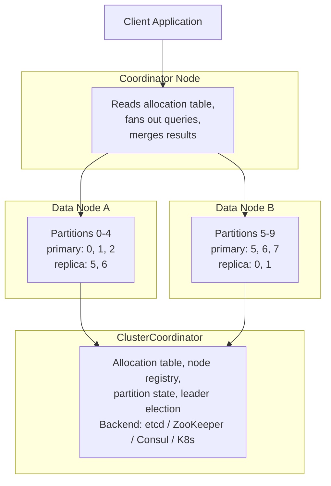

# Narsil Distribution Specification

This document defines the distributed operation mode for Narsil.
When a `ClusterCoordinator` adapter is provided, Narsil operates
as a distributed search engine where indexes span multiple nodes,
partitions are replicated for fault tolerance, and queries are
routed across the cluster. All Narsil implementations must follow
the contracts defined here. Where behaviour is left to the
runtime, this specification says so.

---

## Architecture

Narsil distribution builds on top of the existing single-instance
architecture. The core engine (indexing, search, partitioning,
vector indexes) is unchanged. Distribution adds a cluster-aware
orchestration layer that coordinates multiple Narsil instances
running on separate nodes.

---

## Operating Modes

Narsil operates in one of two modes, determined by whether a
`ClusterCoordinator` adapter is provided at startup.

### Single-Instance Mode

When no `ClusterCoordinator` is provided, Narsil operates as a
standalone engine. All partitions live in memory on the local
instance. Worker threads provide parallelism within the process.
The existing `InvalidationAdapter` coordinates with other
instances sharing the same persistence backend.

This is how Narsil works today. Distribution adds no overhead and
requires no configuration when the feature is not imported.

### Cluster Mode

When a `ClusterCoordinator` is provided alongside a
`NodeTransport`, Narsil operates as a distributed cluster node.
The node registers itself with the coordinator, receives partition
assignments from the allocation table, and participates in
replication and distributed query routing.

Each node plays one or more roles (see
[cluster.md](cluster.md#node-roles)).

---

## Relationship to Existing Specifications

The distribution specification extends the existing Narsil spec
without modifying it. Each existing specification document
continues to apply within a single node:

| Existing Spec | Relationship to Distribution |
|---|---|
| [partitioning.md](../partitioning.md) | Partitions still operate the same way locally. Distribution adds cross-node partition assignment. |
| [algorithms.md](../algorithms.md) | Scoring, hashing, and similarity algorithms are unchanged. DFS scoring extends to collect statistics from remote nodes. |
| [envelope.md](../envelope.md) | The `.nrsl` format is reused for replication snapshots (with an additional metadata header). |
| [adapters.md](../adapters.md) | Existing adapters are unchanged. Two new adapters are added: `ClusterCoordinator` and `NodeTransport`. |
| [invalidation.md](../invalidation.md) | The invalidation protocol remains available for non-clustered multi-process deployments. In cluster mode, replication replaces invalidation. |
| [vector-index.md](../vector-index.md) | Vector indexes operate locally on each data node. Distributed vector search follows the same two-phase query pattern as text search. |

---

## Distribution Specification Documents

| Document | Contents |
|---|---|
| [cluster.md](cluster.md) | Cluster formation, node registration, roles, allocation table, partition state machine, `ClusterCoordinator` adapter |
| [replication.md](replication.md) | Replication log format, sync protocol, recovery, failover, write durability, in-sync tracking |
| [query-routing.md](query-routing.md) | Two-phase distributed query, fan-out, result merging, DFS, distributed facets, partial results, cursor pagination |
| [transport.md](transport.md) | `NodeTransport` adapter, message types, MessagePack wire format |

---

## Pseudocode Convention

This specification uses the same pseudocode convention as the
existing Narsil spec (see [adapters.md](../adapters.md)). Type
definitions are language-neutral and illustrative. Implementations
use their language's native type system.

All data structures exchanged between nodes are serialised as
MessagePack. This is the cross-language wire format for cluster
coordination data, replication log entries, and query
request/response payloads.

---

## Requirement Tiers

This specification follows the same requirement tiers as the
Sirannon specification:

**Normative.** Behaviour that all conforming implementations must
follow. Normative requirements use the word 'must' in lowercase.
Violating a normative requirement means the implementation does
not conform to this specification.

**Implementation-defined.** Behaviour where the specification
defines the contract (inputs, outputs, invariants) but leaves the
mechanism to the runtime.

**Recommended.** Suggested defaults and approaches. Other
implementations may choose different values. Recommended items
include a concrete default value.

---

## Glossary

| Term | Definition |
|---|---|
| **Allocation table** | A mapping from each partition to its primary node and replica nodes, stored in the ClusterCoordinator |
| **Cluster mode** | Narsil's distributed operating mode, activated by providing a ClusterCoordinator adapter |
| **Controller** | A node role responsible for running the partition allocator and managing the allocation table |
| **Coordinator** | A node role responsible for receiving client queries, fanning out to data nodes, and merging results |
| **Data node** | A node role responsible for holding partitions, executing local indexing and search, and participating in replication |
| **In-sync set** | The set of replica nodes that have acknowledged all operations up to the primary's current sequence number |
| **NodeTransport** | An adapter that carries replication and query traffic between nodes |
| **Primary** | The node designated to accept writes for a given partition |
| **primaryTerm** | A monotonically increasing counter that increments on primary failover, used to fence zombie primaries |
| **Replica** | A node that holds a copy of a partition and receives replicated operations from the primary |
| **seqNo** | A per-partition monotonically increasing counter assigned by the primary to each operation |
| **Single-instance mode** | Narsil's standalone operating mode, identical to pre-distribution behaviour |
