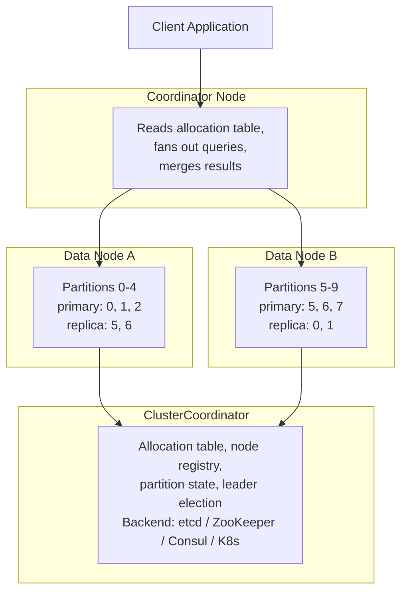

# Narsil Distribution Specification

Narsil runs as a distributed search engine once a `ClusterCoordinator` adapter is supplied. Indexes then span several nodes, partitions are replicated for fault tolerance, and queries are routed across the cluster. Every implementation must follow the contracts defined here. Where a behaviour is left to the runtime, this specification says so.

---

## Architecture

Distribution wraps the single-instance engine and changes nothing inside it. Indexing, search, partitioning, and vector indexes work exactly as they do standalone. What distribution adds is a cluster-aware layer that coordinates several Narsil instances running on separate nodes.

```mermaid
graph TD
    Client[Client Application]

    Client --> Coordinator

    subgraph Coordinator Node
        Coordinator["Reads allocation table,<br/>fans out queries,<br/>merges results"]
    end

    Coordinator --> DataA
    Coordinator --> DataB

    subgraph Data Node A
        DataA["Partitions 0-4<br/>primary: 0, 1, 2<br/>replica: 5, 6"]
    end

    subgraph Data Node B
        DataB["Partitions 5-9<br/>primary: 5, 6, 7<br/>replica: 0, 1"]
    end

    DataA --> CC
    DataB --> CC

    subgraph ClusterCoordinator
        CC["Allocation table, node registry,<br/>partition state, leader election<br/>Backend: etcd / ZooKeeper / Consul / K8s"]
    end
```

---

## Operating Modes

The presence of a `ClusterCoordinator` adapter at startup decides which of the two modes a Narsil instance runs in.

### Single-Instance Mode

Without a `ClusterCoordinator`, Narsil runs standalone. Every partition is held in memory on the local instance, worker threads give parallelism inside the process, and an `InvalidationAdapter` coordinates with other instances sharing the same persistence backend.

A build that never imports the distribution feature pays no cost for it and needs no configuration.

### Cluster Mode

With a `ClusterCoordinator` and a `NodeTransport`, Narsil runs as a cluster node. The node registers itself with the coordinator, takes its partition assignments from the allocation table, and joins replication and distributed query routing.

Each node carries one or more roles; see [Node Roles](cluster.md#node-roles).

---

## Relationship to the Rest of the Specification

Distribution extends the rest of the specification and changes none of it. Every other document still applies inside a single node.

| Document | Relationship to distribution |
|----------|------------------------------|
| [partitioning.md](../partitioning.md) | Partitions work the same way locally. Distribution adds assignment of partitions to nodes. |
| [algorithms.md](../algorithms.md) | Scoring, hashing, and similarity are unchanged. DFS scoring extends to collect statistics from remote nodes. |
| [envelope.md](../envelope.md) | The `.nrsl` format also carries replication snapshots, with an extra metadata header. |
| [adapters.md](../adapters.md) | The existing adapters are unchanged. Distribution adds two: `ClusterCoordinator` and `NodeTransport`. |
| [invalidation.md](../invalidation.md) | The invalidation protocol stays available for multi-process deployments outside a cluster. In cluster mode, replication takes its place. |
| [vector-index.md](../vector-index.md) | Vector indexes work locally on each data node. Distributed vector search follows the same two-phase pattern as text search. |

---

## Distribution Documents

| Document | Contents |
|----------|----------|
| [cluster.md](cluster.md) | Cluster formation, node registration, roles, the allocation table, the partition state machine, and the `ClusterCoordinator` adapter |
| [replication.md](replication.md) | Replication log format, sync protocol, recovery, failover, write durability, and in-sync tracking |
| [query-routing.md](query-routing.md) | Two-phase distributed query, fan-out, result merging, DFS, distributed facets, partial results, and cursor pagination |
| [transport.md](transport.md) | The `NodeTransport` adapter, message types, and the MessagePack wire format |

---

## Notation

This specification uses the same language-neutral notation as the rest of the Narsil specification; see [Notation](../adapters.md#notation). Type definitions illustrate the contract, and each implementation expresses them in its own type system.

Every structure exchanged between nodes is serialised as MessagePack. That is the cross-language wire format for coordination data, replication log entries, and query request and response payloads alike.

---

## Requirement Tiers

**Normative.** Every conforming implementation must follow the behaviour. Normative requirements use the lowercase word 'must'. A build that violates one does not conform.

**Implementation-defined.** The specification fixes the contract, meaning the inputs, the outputs, and the invariants, and leaves the mechanism to the runtime.

**Recommended.** These are the defaults the reference implementation uses, each stated with a concrete value. Another implementation may choose differently.

---

## Glossary

| Term | Definition |
|------|------------|
| **Allocation table** | The mapping from each partition to its primary node and its replica nodes, stored in the cluster coordinator |
| **Cluster mode** | The distributed operating mode, activated by supplying a `ClusterCoordinator` adapter |
| **Controller** | The node role that runs the partition allocator and maintains the allocation table |
| **Coordinator** | The node role that receives client queries, fans them out to data nodes, and merges the results |
| **Data node** | The node role that holds partitions, runs local indexing and search, and takes part in replication |
| **In-sync set** | The replica nodes that have acknowledged every operation up to the primary's current sequence number |
| **NodeTransport** | The adapter that carries replication and query traffic between nodes |
| **Primary** | The node that accepts writes for a given partition |
| **primaryTerm** | A counter that increases on every primary failover, used to fence a primary that no longer holds authority |
| **Replica** | A node holding a copy of a partition and receiving replicated operations from the primary |
| **seqNo** | A per-partition counter, increasing monotonically, that the primary assigns to each operation |
| **Single-instance mode** | The standalone operating mode, identical to running without distribution |
